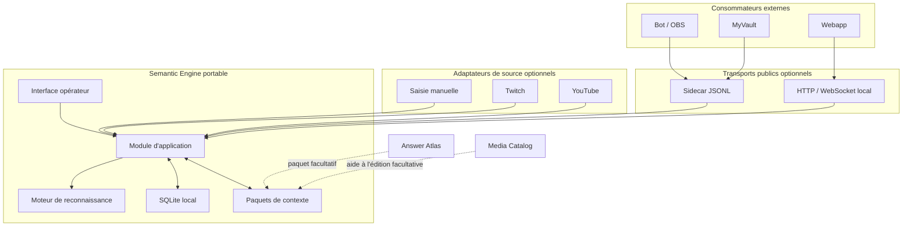

# Architecture autonome et modulaire

Semantic Engine est un produit autonome. L'application portable contient le
moteur, l'interface opérateur, le stockage local et les outils de gestion des
paquets de contexte. Aucun autre projet, catalogue ou service distant n'est
nécessaire pour créer un contexte, reconnaître une réponse ou arbitrer une
décision.



Les flèches de dépendance vont vers Semantic Engine. Le moteur n'importe aucun
type, code ou identifiant d'un consommateur externe.

## Modules et interfaces

Le moteur est un module profond : une petite interface cache normalisation,
sélection des candidats, scores, calibration, abstention et mémoire.

```text
recognize(request) -> RecognitionResult
feedback(correction) -> FeedbackReceipt
```

Une correction n'entraîne rien silencieusement : elle crée une version révocable.
OAuth, transport réseau, webhooks, score et affichage restent hors de cette
interface.

| Module | Responsabilité | Ignore |
|---|---|---|
| `semantic-engine-core` | reconnaître, s'abstenir, expliquer | Tauri, HTTP, Twitch, utilisateurs |
| `semantic-engine-package` | vérifier et importer un paquet | sessions et transports |
| `semantic-engine-context-store` | versions, activation, brouillons et rollback | plateformes externes |
| `semantic-engine-audit-store` | validations minimisées, résolutions et rétention | chat brut, Tauri et score |
| `semantic-engine-service` | déduplication, cache borné et orchestration moteur/audit | Tauri et règles métier des consommateurs |
| `semantic-engine-session-store` | sessions, livraisons idempotentes et événements durables | règles de reconnaissance et texte du chat |
| `semantic-engine-protocol` | commandes de session et réponses versionnées indépendantes du transport | stdin, HTTP, Tauri et plateformes |
| `semantic-engine-loopback` | HTTP/WebSocket local, auth éphémère, origines et backpressure | moteur, Tauri et plateformes live |
| `semantic-engine-source` | contrat, configuration durable et cycle pause/actif des sources | secrets et algorithmes de reconnaissance |
| `semantic-engine-source-runtime` | orchestration réutilisable des adaptateurs, du coffre et de l'ordre global | Tauri, HTTP et règles de score |
| `semantic-engine-credential-vault` | interface bornée vers le coffre natif du système | SQLite, chat et logique Twitch |
| `semantic-engine-twitch` | OAuth public, EventSub, reconnexion et traduction vers `SourceMessage` | score, victoire et contexte métier |
| adaptateur de transport | traduire IPC, JSONL ou HTTP vers l'interface commune | algorithmes de reconnaissance |
| adaptateur de source | traduire une plateforme vers `Submission` | score et victoire |

## Où se situe l'interface publique ?

Elle appartient à ce dépôt et se compose de trois niveaux :

1. `contracts/` contient les schémas JSON versionnés qui forment le contrat
   indépendant du langage ;
2. `semantic-engine-protocol` traduit ces contrats vers un service partagé ;
3. la CLI expose ce contrat par un sidecar JSONL local ;
4. `semantic-engine-source-runtime` assemble les adaptateurs live et attribue
   l'ordre global durable avant le service ;
5. `semantic-engine-loopback` expose sessions, événements et sources en HTTP et
   WebSocket, sans déplacer la logique hors du produit.

Les contrats d’adaptateur `input-source.schema.json` et
`source-message.schema.json` sont déjà publiés dans ce même dossier. Leur plan de
contrôle réseau reste à raccorder : un client public ne recevra jamais la valeur
d’un jeton, seulement l’état d’autorisation et un `credential_id` opaque.

Dans l'application portable, l'adaptateur réseau sera embarqué dans le même
exécutable et désactivé par défaut. Quand l'opérateur l'active, il écoute
uniquement sur `127.0.0.1`, avec un jeton local, des origines autorisées
explicitement, des limites de débit et un journal d'audit. « Publique » signifie
ici documentée, stable et utilisable par tout client ; cela ne signifie pas
exposée publiquement sur Internet.

La CLI peut déjà héberger localement les mêmes modules source et loopback sans
Tauri. Une exposition LAN ou Internet exigera un mode séparé, une configuration
explicite, TLS, une authentification adaptée et les protections décrites dans la
documentation de sécurité.

L'interface réseau initiale doit rester petite :

- créer, consulter et terminer une session ;
- référencer une version de contexte dans une session et fournir sa manche ;
- soumettre un message et obtenir sa validation ;
- enregistrer une résolution opérateur ;
- suivre les événements de session ;
- ajouter, autoriser, démarrer, mettre en pause et supprimer des sources ;
- vérifier santé, version et compatibilité du contrat.

Les endpoints sont décrits dans `contracts/loopback-openapi.yaml` et figés par
les tests Rust et les deux clients Node du kit `conformance/`.

## Modes d'utilisation

| Mode | Processus | Réseau | Usage |
|---|---:|---:|---|
| application portable | 1 | aucun par défaut | produit complet pour l'opérateur |
| sidecar JSONL | 1 enfant | non | automatisation locale et intégration immédiate |
| passerelle loopback | 1 | `127.0.0.1` opt-in | webapps et outils locaux |
| serveur headless | 1 ou plusieurs | explicite | hébergement ou offre de service future |

Tauri appelle le module d'application en mémoire. Il ne doit jamais dépendre de
sa propre passerelle HTTP pour fonctionner.

## Ressources externes

- Answer Atlas est un fournisseur facultatif de paquets diffusables. Un paquet
  entièrement créé dans l'application reste un cas de premier rang.
- Media Catalog est une source facultative de métadonnées et de titres localisés
  pendant la préparation d'un paquet. Il n'est jamais interrogé sur le chemin
  temps réel d'une validation.
- MyVault, OBS, les bots et les webapps sont des consommateurs optionnels des
  interfaces publiques. Leur indisponibilité ne dégrade pas le produit autonome.

## Socle et évolution

Rust porte le moteur, les contrats et le chemin critique. Tauri 2 fournit
l'application portable, avec une interface web embarquée. SQLite conserve les
contextes, les brouillons, la mémoire locale et l'audit.

Le premier déploiement reste un monolithe modulaire : moins de latence, moins de
processus et un dossier portable. Les mêmes interfaces permettent ensuite de
déplacer un adaptateur dans un sidecar ou un microservice si un besoin mesuré le
justifie.

L'arborescence ne doit évoluer que lorsqu'un premier code la traverse :

```text
crates/
  semantic-engine-core/
  semantic-engine-package/
  semantic-engine-context-store/
  semantic-engine-audit-store/
  semantic-engine-session-store/
  semantic-engine-service/
  semantic-engine-protocol/
  semantic-engine-loopback/      # adaptateur HTTP/WebSocket local
  semantic-engine-source/        # contrat générique et stockage des sources
  semantic-engine-source-runtime/# orchestration live partagée Tauri/headless
  semantic-engine-credential-vault/
  semantic-engine-twitch/        # adaptateur Twitch facultatif
apps/
  desktop/
  semantic-engine-cli/
  semantic-engine-server/        # futur hôte réseau TLS ; headless local déjà dans la CLI
contracts/
tests/
```

Éviter les modules `utils` ou `common`, les squelettes vides et tout adaptateur
nommé d'après un consommateur particulier dans le cœur du produit.

## Validation réutilisable

Le moteur ne compte pas les points. Il produit un événement idempotent contenant
`round_id`, `message_id`, `participant_id`, ordre source, décision, cible reconnue,
confiance, indices et temps de traitement. Tout workflow externe peut ensuite
attribuer exactement une fois le point à la première acceptation.
