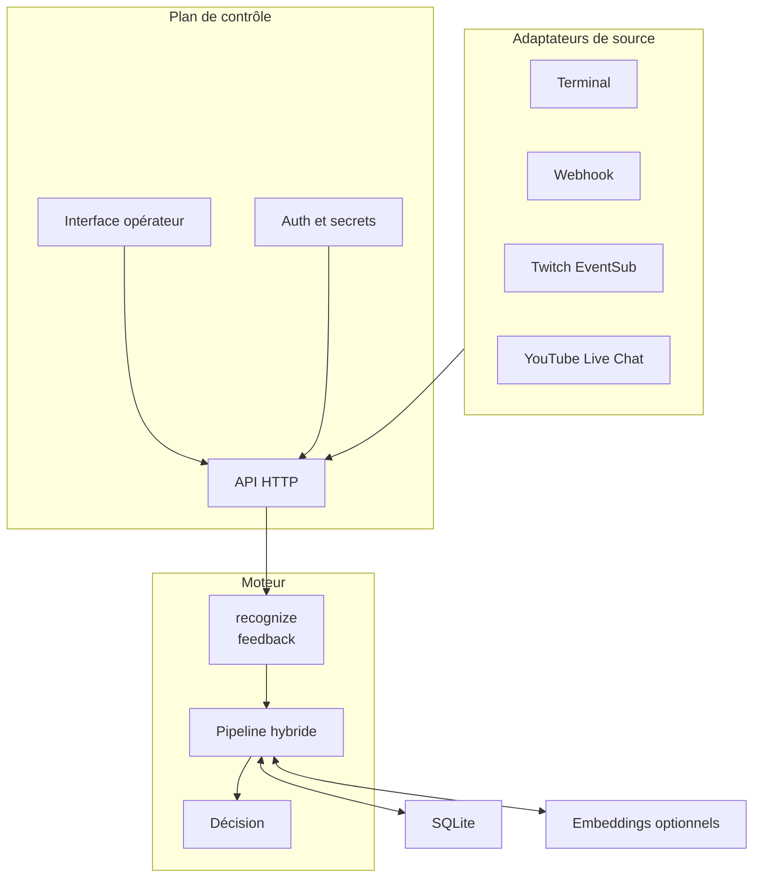

# Architecture modulaire

Le moteur est un module profond : une petite interface cache normalisation,
candidats, scores, calibration, abstention et mémoire. Les plateformes restent
dans des adaptateurs.



## Interface

```text
recognize(request) -> RecognitionResult
feedback(correction) -> FeedbackReceipt
```

Une correction n’entraîne rien silencieusement : elle crée une version révocable.
OAuth, webhooks et affichage restent hors de cette interface.

| Module | Responsabilité | Ignore |
|---|---|---|
| `engine` | reconnaître, s’abstenir, expliquer | Twitch, HTTP, utilisateurs |
| `context` | valider et versionner les sens | transport |
| `memory` | cache et exemples validés | règles plateforme |
| `source` | enveloppe d’entrée canonique | algorithmes |
| `control-plane` | configurer, autoriser, superviser | détails des scores |

## Socle recommandé

Rust porte le moteur, ses contrats et le chemin critique. Tauri 2 fournit
l’application portable, avec une interface web réutilisable dans le navigateur.
SQLite conserve contextes et mémoire locale.

Le premier déploiement est un monolithe modulaire embarqué : moins de latence,
moins de processus et un dossier portable. Les mêmes interfaces permettent de
déplacer ensuite le moteur dans un sidecar, un processus local ou un microservice.
Rust et l’architecture de services sont donc dans la cible ; seul le découpage
distribué avant preuve de besoin est différé.

Sur Windows, un dossier portable peut utiliser WebView2 système ou embarquer un
runtime fixe pour un vrai mode hors ligne. Le package x64 actuellement vérifié
pèse environ 690 Mo extrait ; cette taille doit être mesurée à chaque version.

## Validation réutilisable

Le moteur ne compte pas les points. Il produit un événement idempotent contenant
`round_id`, `message_id`, `participant_id`, ordre source, décision, cible reconnue,
confiance, indices et temps de traitement. MyVault ou un autre workflow peut alors
attribuer exactement une fois le point à la première acceptation.

## Arborescence cible

```text
crates/{semantic-engine-core,semantic-engine-service}
apps/{desktop,cli}
contracts/
tests/{corpus,contract}
```

Ne créer ces dossiers qu’avec du code traversant. Éviter `utils`, `common` et les
squelettes vides.

## API envisagée

- `POST/PUT /v1/contexts`
- `POST /v1/recognitions`
- `POST /v1/corrections`
- `POST/DELETE /v1/source-connections`
- `GET /v1/health` et `/v1/metrics`
