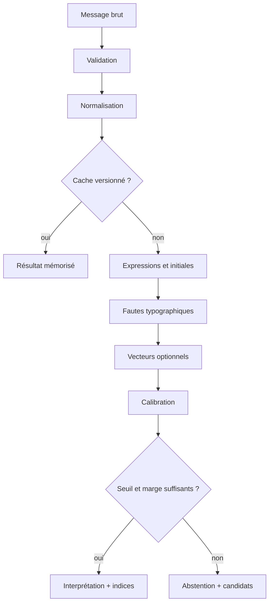

# Pipeline de reconnaissance

Les techniques sont ordonnées de la moins coûteuse et plus explicable à la plus souple.



## Contexte, pas dictionnaire global

**Non, un dictionnaire global n’est pas obligatoire.** Le minimum est une cible
canonique par round, par exemple `Elden Ring`. Les alias (`ER`, titre VF, nom
historique) sont des données locales à cette cible. Ils améliorent la couverture
sans imposer une base linguistique générale.

Pour le cas « guess the movie/game », l’ordre actuel est :

1. importer un paquet de contexte inactif et vérifier profil, licence, chemins,
   tailles, empreintes et structure ;
2. contrôler identifiants, politique et nombre de candidats ;
3. normaliser Unicode, casse, accents, ponctuation et espaces ;
4. tester titre, alias, acronymes et formes compactes ;
5. comparer les fautes avec un score typographique hybride ;
6. protéger les numéros significatifs des suites (`Portal` ≠ `Portal 2`) ;
7. accepter, s’abstenir ou rejeter selon les seuils et l’écart au second ;
8. restituer identité et ordre source au workflow d’arbitrage.

Le dictionnaire appartient au contexte, pas au moteur :

```yaml
interpretations:
  - id: paris
    expressions:
      canonical: ["paris"]
      aliases: ["paname"]
      abbreviations: ["p"]
```

Il est rapide et auditable. Une abréviation n’est valide que dans un contexte où
elle n’entre pas en conflit avec une autre interprétation.
Le format diffusable correspondant est le [paquet de contexte](../integration/context-packages.md) :
les données restent indépendantes du moteur et conservent version, provenance,
licence et intégrité.

## Fautes

Une distance de caractères ou de tokens couvre lettres oubliées et inversées.
Le seuil dépend de la longueur : une faute sur deux lettres est plus ambiguë que
sur douze. Le nombre de candidats et le temps de calcul sont plafonnés.

## Vecteurs

Un modèle d’**embeddings** transforme chaque texte en liste de nombres. Des
formulations de sens voisin doivent produire des points proches. Les expressions
connues sont pré-calculées ; l’énoncé est comparé à leurs voisins.

Les vecteurs aident pour synonymes et paraphrases, mais ne donnent ni vérité,
ni seuil universel, ni protection contre une ambiguïté métier. Le modèle reste
donc local, versionné et optionnel derrière un adaptateur.

La couture `semantic-engine-vectors` matérialise cette règle sans dépendance ML :
elle construit un index sérialisable lié à `(version du contexte, identifiant du
modèle, fingerprint, dimensions)`, compare les cosinus et applique seuil plus
marge. L’adaptateur FastEmbed vit uniquement dans un benchmark séparé. Le cœur,
Tauri, la CLI et leurs SBOM n’importent donc jamais ONNX par transitivité.

## Décision

Pour des **titres courts**, les vecteurs ne sont pas le premier levier : un bon
jeu d’alias et une normalisation explicable sont plus rapides et souvent plus
précis. Le benchmark v2 actuel donne 92,38 % d’exactitude et 6 faux positifs
après calibration, contre 100 % et zéro faux positif pour le lexical ; les
embeddings restent donc désactivés. Ils ne pourront être proposés à nouveau
qu’après un gain sur un corpus aveugle de paraphrases réelles, sans perte de
précision.

Les signaux exacts, abréviations, distances et proximités sémantiques sont
calibrés. Le meilleur candidat n’est accepté que si sa confiance et son avance
sur le second dépassent deux seuils ; sinon le moteur s’abstient.

## Mémoire

Séparer deux mécanismes :

- **cache** : `hash(énoncé + contexte + moteur + modèle)`, avec TTL et limite ;
- **exemples appris** : corrections d’un opérateur, versionnées, testées et révocables.

Une répétition dans le chat ne devient jamais un apprentissage. Provenance,
quotas, isolation des contextes et rollback protègent contre l’empoisonnement.
Contrat cible après ajout du versioning, des alternatives et de la mémoire :


```json
{
  "decision": "accepted",
  "interpretation_id": "paris",
  "confidence": 0.97,
  "alternatives": [{"id": "parme", "confidence": 0.21}],
  "evidence": [{"kind": "known-expression", "detail": "alias: paname"}],
  "context_version": "ctx_12",
  "engine_version": "0.1.0"
}
```
