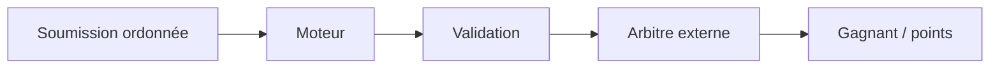

# Langage du domaine

Ces termes empêchent de confondre reconnaissance et logique de jeu. Le fichier
racine `CONTEXT.md` reste la référence détaillée destinée aux agents et outils.

| Terme | Sens dans Semantic Engine |
|---|---|
| Source d’entrée | Origine externe : terminal, webhook, Twitch ou YouTube. |
| Message brut | Contenu reçu avant validation et normalisation. |
| Contexte de reconnaissance | Ensemble versionné de cibles, expressions et politiques. |
| Expression connue | Titre canonique, alias ou abréviation rattaché à une cible. |
| Round | Fenêtre identifiée pendant laquelle des cibles sont acceptables. |
| Cible | Œuvre ou sens attendu, avec titre canonique et alias. |
| Soumission | Réponse d’un participant, identifiée et ordonnée par la source. |
| Validation | Décision déterministe du moteur sur une soumission. |
| Acceptation | Validation positive consommable de façon idempotente. |
| Abstention | Refus de choisir quand le signal est insuffisant. |
| Arbitrage | Choix externe de la première acceptation selon l’ordre source. |
| Correction | Décision confirmée par un opérateur. |
| Mémoire de reconnaissance | Exemples validés et résultats réutilisables, versionnés. |

## Frontière essentielle

Le moteur peut dire « acceptée » mais jamais « gagnant ». Cela permet de le
réutiliser pour un formulaire, une recherche tolérante ou une commande vocale
sans importer les règles d’un quiz.

## Mémoire et cache

Le cache réutilise un calcul. La mémoire de reconnaissance contient uniquement
des exemples confirmés, avec provenance et possibilité de rollback. Une
répétition de chat n’est donc pas automatiquement apprise.

## Termes à éviter

- « IA qui comprend » : préférer décision contre un contexte configuré ;
- « dictionnaire global » : préférer expressions du contexte ;
- « historique du chat » pour parler de mémoire ;
- « prédiction » lorsque la sortie contractuelle est une validation ;
- « gagnant » dans les types ou méthodes du moteur.
