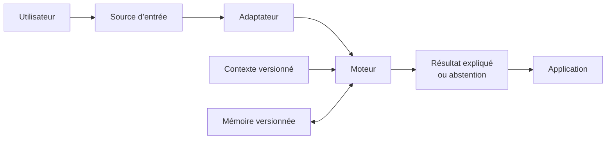

# Semantic Engine

Semantic Engine reconnaît une interprétation configurée dans des messages réels,
même abrégés, mal orthographiés ou reformulés, sans imposer un LLM distant.

## Valeur

- L’utilisateur peut faire des fautes et employer des raccourcis.
- L’opérateur configure les sens possibles et comprend les décisions.
- L’intégrateur ajoute une source sans modifier le moteur.
- L’hébergeur garde les données et les coûts sous contrôle local.

Le produit n’est ni un chatbot génératif, ni un système autonome de modération,
ni un entrepôt permanent de conversations.

## Parcours conseillé

1. [Vision produit](product/vision.md)
2. [Architecture](architecture/overview.md)
3. [Dictionnaire, vecteurs et mémoire](architecture/recognition-pipeline.md)
4. [Importer et diffuser un paquet de contexte](integration/context-packages.md)
5. [Sécurité et cadre légal](product/security-and-legal.md)
6. [Connecter Twitch](integration/twitch.md)
7. [Connecter YouTube Live](integration/youtube.md)
8. [Distribuer et vérifier une release](product/releases.md)
9. [Roadmap](roadmap.md)

Le projet possède un moteur Rust testé, une application portable, des contextes
Data Package vérifiés, des sessions/audits durables et une API locale/headless.
Twitch est intégré de bout en bout. YouTube Live possède son flux vertical OAuth,
coffre, découverte des diffusions actives, `streamList` gRPC, API et UI, mais sa
conformité verdict/score et ses mesures sur un live réel restent des critères de
sortie explicites de M4. La CI construit désormais les prévisualisations CLI
Windows, Linux et macOS avec checksums et attestations de provenance ; une release
publique reste bloquée par le choix de licence et la signature Windows native.
