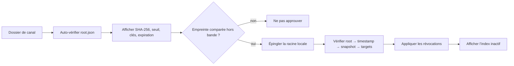

# Découvrir des contextes signés

Un **canal de contextes** est un dépôt statique conforme à The Update Framework
(TUF) v1. Il distribue des Data Packages sans transformer Semantic Engine en
client d’un service propriétaire.

## Deux interfaces, deux responsabilités

- L’API de contrôle de Semantic Engine reste locale, opt-in et liée à
  `127.0.0.1`. Elle pilote sessions, validations et sources de chat.
- L’API publique des données est un ensemble de fichiers statiques TUF. Le canal
  Answer Atlas est destiné à `https://w-d0n.github.io/answer-atlas/` après sa
  cérémonie de signature initiale.

MyVault, Media Catalog ou une boutique peuvent produire ou consommer ces fichiers,
mais aucun n’est requis par l’application portable.

## Structure

```text
canal/
├── metadata/
│   ├── root.json
│   ├── timestamp.json
│   ├── snapshot.json
│   └── targets.json
└── targets/
    ├── channel-profile.json
    ├── revocations-v1.json
    └── answer-atlas-core-titles-0.1.0.zip
```

Le profil signé énumère les archives et leurs métadonnées Semantic Engine. Les
archives sont épinglées par longueur et SHA-256 dans TUF. Un producteur plus grand
peut déléguer des chemins à d’autres rôles : le client Rust suit ces délégations
avec les limites configurées.

Les contrats publics sont :

- `contracts/context-channel-profile-v1.schema.json` ;
- `contracts/context-target-v1.schema.json` ;
- `contracts/context-revocations-v1.schema.json`.

## Établir la confiance



Une racine auto-signée est cohérente, mais ne prouve pas l’identité de l’éditeur.
L’opérateur compare son SHA-256 sur un canal indépendant avant la première
approbation. L’application conserve ensuite cette racine et l’état TUF dans son
dossier local ; les protections rollback et freeze survivent aux redémarrages.

Les révocations observées deviennent des tombstones append-only. Une liste plus
récente qui omet une ancienne révocation ne réactive donc pas silencieusement une
archive déjà refusée.

Après chaque vérification, l’application enregistre aussi le statut signé de
chaque identité de paquet dans SQLite. Une identité révoquée ne peut plus être
activée. Si elle est déjà active, elle est mise en quarantaine, la session en
cours est clôturée et ses sources de chat sont arrêtées ; aucune archive saine
n’est installée ou activée automatiquement.

## CLI locale

```powershell
# Examiner une racine candidate, sans lui faire confiance
cargo run -q -p semantic-engine-cli -- context channel inspect-root `
  --root C:\canal\metadata\root.json

# Vérifier un canal hors ligne avec une racine approuvée et un état persistant
cargo run -q -p semantic-engine-cli -- context channel verify `
  --channel C:\canal `
  --root C:\trust\answer-atlas-root.json `
  --state C:\trust\answer-atlas-state
```

Dans l’application portable, **Canaux de contextes** reproduit ce flux : sélection
du dossier, affichage complet de l’empreinte, approbation explicite, fraîcheur,
versions de métadonnées, paquets et état de révocation. La vérification n’active
et n’exécute rien. Elle peut en revanche désactiver un contexte révoqué déjà
installé. L’import d’un paquet sain reste une opération locale séparée.

## Limites de sécurité

Le client borne racine et métadonnées, nombre de paquets, délégations, taille des
archives, textes, identifiants, locales et révocations. Il confine toutes les
lectures au dossier choisi, refuse traversées et liens sortants, exige SemVer et
SPDX, et ne suit aucune URL fournie par le canal pendant l’inspection hors ligne.

Le format TUF utilise la sérialisation canonique TUF historique ; il ne faut pas
remplacer cette vérification par JCS/RFC 8785. Le Data Package garde ses propres
contrôles de schéma, chemins et hashes lors de l’import.
