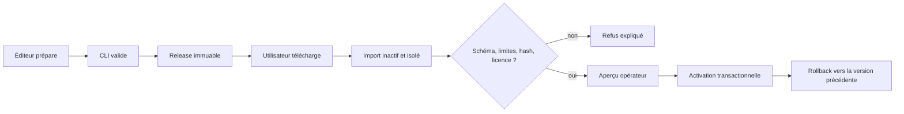

# Importer et diffuser un paquet de contexte

Le paquet de contexte est la ressource partageable du moteur. Il contient les
cibles, titres canoniques, alias et métadonnées nécessaires pour comprendre,
vérifier et réutiliser ces données sans dépendre du dépôt de l’éditeur.

## Structure minimale

```text
mon-contexte/
├── datapackage.json
├── README.md
├── LICENSE.md
├── data/
│   └── titles.json
└── profile/
    ├── context-package.schema.json
    └── title-resource.schema.json
```

Le paquet de référence se trouve dans `packages/starter-titles`. Il contient
20 films et 64 jeux vidéo, avec titres VO/VF et alias curatés ; son propre
`README.md` voyage avec les données lors de la distribution.

## Vérifier avant import

```powershell
cargo run -q -p semantic-engine-cli -- context validate `
  --package packages/starter-titles/datapackage.json
```

La CLI actuelle reçoit le descripteur d’un dossier ; une archive ZIP doit donc
être extraite avant validation. L’import direct d’archive appartient au prochain
flux graphique et devra appliquer les mêmes protections contre les chemins `..`.

Une sortie valide fournit identité, version, provenance, nombre de cibles et deux
SHA-256 : la ressource seule et l’ensemble des octets manifeste+ressource.
La commande ne modifie aucun contexte actif.

Dans l’application portable, la bande **Contexte de reconnaissance** ouvre le
sélecteur Windows, puis transmet uniquement le chemin choisi au backend Rust.
L’aperçu affiche nom, version, licence, langues, sources, nombre de réponses et
empreinte. L’opérateur active ensuite explicitement le paquet ; le contexte actif
est persisté dans SQLite et relu au démarrage. À l’activation, le backend relit le
paquet et refuse l’opération si son empreinte diffère de celle de l’aperçu.
**Version précédente** restaure atomiquement le parent de l’activation courante.
L’atelier **Voir et régler le dictionnaire** recherche ensuite dans le contexte
actif, permet de créer un brouillon local et d’utiliser la cible sélectionnée pour
la manche sans modifier le paquet publié.

### Brouillons locaux et diffusion

Un brouillon est indexé par `(package_sha256, target_id)` dans SQLite. Il peut
modifier le titre canonique et les alias, persiste après redémarrage et disparaît
avec **Revenir au publié**. La recherche fusionne paquet et brouillons en une
lecture groupée, puis ne renvoie au frontend qu’un résultat borné.

Le brouillon n’est pas encore un paquet diffusable. L’export futur devra produire
une nouvelle version SemVer, recalculer les empreintes et passer la même validation
qu’un paquet tiers. Une version déjà publiée ne sera jamais réécrite.

```json
{
  "status": "valid",
  "id": "urn:semantic-engine:context:starter-titles",
  "name": "semantic-engine-starter-titles",
  "version": "0.1.0",
  "targets": 84,
  "locales": ["en", "fr"],
  "license": "CC0-1.0",
  "sources": [{
    "title": "Manually curated Semantic Engine test corpus",
    "version": "0.1.0",
    "path": null
  }],
  "package_sha256": "b1ccb8cc500d04011e66ccfd09c52711be4f190d58e1c1a25cf7363106eb432e",
  "targets_sha256": "062cc8a6223685ac8fb0d6112b8393a5d849dd8d4dcba648dac719679a82b8c1"
}
```

## Créer un paquet

1. Copier l’arborescence du paquet de référence.
2. Donner un `id` global et un `name` stable, sans version dans le nom.
3. Éditer `data/titles.json` : identifiants stables, titre canonique, type et alias.
4. Déclarer provenance, contributeurs et licence de données.
5. Choisir une version SemVer et ne jamais remplacer une version publiée.
6. Recalculer `bytes` et `sha256:` de chaque ressource.
7. vérifier le paquet avec la CLI sur une copie propre.

Le générateur du corpus de démonstration montre comment produire le manifeste :

```powershell
node scripts/build-title-corpus.mjs
```

Les titres ne sont pas une copie de datasets IMDb, TMDB ou IGDB. Réutiliser des
données tierces exige de vérifier leurs droits, leurs conditions et l’attribution.

## Publier sans friction

Pour la première version, publier un ZIP dans une release Git et joindre :

- le ZIP, dont `datapackage.json` est à la racine ;
- un fichier de sommes SHA-256 ;
- la licence des données et le README ;
- une URL immuable par version ;
- les notes de changement et les versions du format compatibles.

Un site statique ou un stockage objet fonctionne de la même façon. Le futur
catalogue public sera un index, pas un entrepôt imposé : les éditeurs gardent
leur hébergement, Semantic Engine découvre et vérifie leurs paquets.

Le nom conseillé pour le dépôt public de données est **Answer Atlas**
(`answer-atlas`). « Atlas » évoque une collection organisée et extensible, tandis
que le moteur reste libre de consommer d’autres atlas. Si la priorité absolue
devient la découvrabilité technique, `semantic-context-packs` reste l’alternative
descriptive. Le dépôt de données doit rester séparé du code du moteur.

## Flux produit visé



Aujourd’hui, validation, aperçu, activation idempotente, rollback, recherche de
cibles et brouillons locaux sont disponibles dans des modules Rust séparés et
dans le client Tauri. SQLite conserve les versions immuables, le contexte actif,
le lien vers l’activation précédente et les calques locaux. Le prochain incrément
exportera ces calques comme une nouvelle version vérifiable.

## Compatibilité et mises à jour

Un consommateur accepte un paquet seulement si son `formatVersion` est supporté.
Mettre à jour crée une nouvelle version à côté de l’ancienne ; cela rend possible
la comparaison, le rollback et des caches indexés par
`(package_id, version, package_sha256)`. L’empreinte composite couvre actuellement
le manifeste brut, un octet séparateur nul et l’unique ressource `targets`.
Une release révoquée reste identifiable ; elle n’est jamais silencieusement réécrite.

## Ce que le paquet ne doit jamais contenir

- code exécutable ou script lancé à l’import ;
- secrets, jetons OAuth ou données personnelles de participants ;
- historique de chat brut ;
- chemin absolu vers la machine de l’éditeur ;
- ressource distante chargée implicitement à la validation ;
- « apprentissage » dérivé d’utilisateurs sans consentement et provenance.

Voir la [recherche et les conventions](../research/context-package-conventions.md)
pour les standards retenus et leurs compromis.
