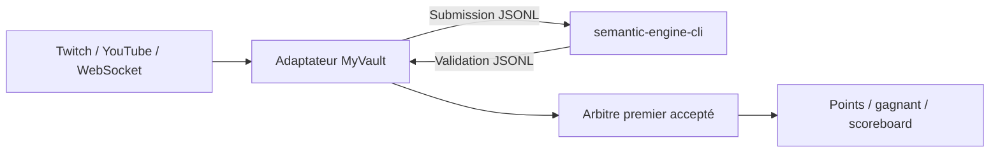

# Intégration locale JSONL

La CLI expose le moteur comme un **sidecar local** : le client garde le processus
ouvert, écrit une soumission JSON par ligne sur l’entrée standard et reçoit une
validation JSON par ligne sur la sortie standard. Il n’y a ni réseau, ni compte,
ni coût par requête.

## Essai rapide

```powershell
Get-Content examples/submissions.jsonl |
  cargo run -q -p semantic-engine-cli -- validate --round examples/rounds/elden-ring.json
```

La sortie contient, dans le même ordre, une acceptation, une abstention et un
rejet. `source_sequence` demeure inchangé : le workflow appelant peut donc
arbitrer le premier message accepté sans confondre reconnaissance et attribution
des points.

## Contrat

Les schémas stables sont dans :

- `contracts/submission.schema.json` ;
- `contracts/validation.schema.json`.

La validation contient toujours l’identité du round, du message, du participant
et l’ordre fourni par la source. Le moteur ne déclare jamais un vainqueur.



## Intégration MyVault

MyVault possède déjà un bus d’événements typé et une couche WebSocket. Un
adaptateur peut démarrer le sidecar une fois, traduire les messages du chat en
`Submission`, puis republier chaque `Validation` sur ce bus. Cette frontière
évite de coupler le moteur au modèle de score du jeu.

Pour une webapp distante, trois modes conservent le même contrat :

1. sidecar lancé par le serveur MyVault ;
2. microservice Rust exposant le même appel ;
3. bibliothèque compilée en WebAssembly lorsque les contraintes navigateur le
   justifient.

Le mode 1 est prioritaire pour le prototype : faible latence, aucun port réseau
à sécuriser et diagnostic simple.
