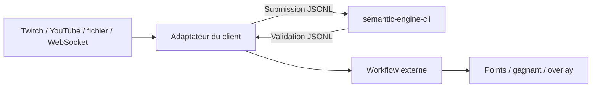

# Intégration locale JSONL

La CLI expose le moteur comme un **sidecar local générique** : tout client peut
garder le processus ouvert, écrire une requête JSON par ligne sur l'entrée
standard et recevoir exactement une réponse JSON corrélée par ligne. Il n'y a
ni réseau, ni compte, ni coût par requête.

## Essai rapide

```powershell
cargo run -q -p semantic-engine-cli -- serve
```

Envoyer ensuite une requête par ligne, en gardant le processus ouvert :

```json
{"protocol_version":1,"request_id":"req-1","command":"start_session","params":{"session_id":"live-1","round":{"id":"round-1","targets":[{"id":"elden-ring","canonical":"Elden Ring","aliases":["ER"]}],"policy":{"accept_threshold":0.87,"review_threshold":0.72,"ambiguity_margin":0.05}},"context_package_sha256":null}}
{"protocol_version":1,"request_id":"req-2","command":"submit","params":{"session_id":"live-1","submission":{"message_id":"msg-1","participant_id":"viewer-7","source_sequence":1,"text":"eldern ring"}}}
{"protocol_version":1,"request_id":"req-3","command":"events","params":{"session_id":"live-1","after_sequence":0,"limit":100}}
{"protocol_version":1,"request_id":"req-4","command":"end_session","params":{"session_id":"live-1"}}
```

Les commandes disponibles sont `start_session`, `get_session`, `submit`,
`resolve`, `events`, `end_session` et `stats`. `request_id` sert uniquement à la
corrélation. La sortie conserve l'ordre des lignes et `source_sequence` demeure
inchangé : le workflow appelant peut arbitrer le premier message accepté sans
confondre reconnaissance et attribution des points.

Le mode historique reste disponible pour les scripts à une seule manche :

```powershell
Get-Content examples/submissions.jsonl |
  cargo run -q -p semantic-engine-cli -- validate --round examples/rounds/elden-ring.json
```

## Contrat

Les schémas stables sont dans :

- `contracts/submission.schema.json` ;
- `contracts/validation.schema.json` ;
- `contracts/operator-resolution-request.schema.json` ;
- `contracts/operator-resolution.schema.json` ;
- `contracts/round.schema.json` ;
- `contracts/session-start.schema.json` et `session.schema.json` ;
- `contracts/session-event.schema.json` et `session-events-page.schema.json` ;
- `contracts/protocol-request.schema.json` et `protocol-response.schema.json`.

La validation contient toujours l'identité du round, du message, du participant
et l'ordre fourni par la source. Le moteur ne déclare jamais un vainqueur.

Une application peut ensuite émettre une `OperatorResolution` à partir d'une
validation conservée côté backend. Sa clé d'idempotence est
`(round_id, message_id)` ; participant et ordre source sont recopiés depuis la
preuve backend, jamais depuis une requête d'arbitrage non fiable.

## Cycle, reprise et limites

`start_session` est idempotente si la définition est identique. Réutiliser le
même identifiant avec une autre manche ou une autre empreinte de contexte produit
un conflit explicite. Une session terminée refuse les nouvelles soumissions et
résolutions. Les événements portent une séquence monotone et excluent le texte
du chat ainsi que l'expression reconnue.

Le journal de session est **borné et persistant** lorsque le sidecar reçoit
`--audit <chemin.sqlite3>`. Sans cette option, `serve` reste volontairement
éphémère. Une page `events` fournit `earliest_available_sequence`,
`latest_sequence` et `truncated`; un client ne doit donc jamais interpréter une
absence comme la preuve qu'aucun événement antérieur n'a existé. L'application
portable active toujours la persistance et reprend sa dernière session active.

Le transport refuse une ligne supérieure à 1 Mio, renvoie une erreur structurée,
vide la fin de cette ligne puis continue avec la suivante. Il ne faut jamais
envoyer de secret dans `request_id`, les notes ou les identifiants.

## Client indépendant et conformité

`conformance/clients/node-client.mjs` est un consommateur sans dépendance npm et
sans import du code Rust. Il lance deux fois le sidecar sur la même base et
vérifie le cycle, la corrélation, les erreurs, la reprise et la minimisation :

```powershell
cargo build -p semantic-engine-cli
node conformance/clients/node-client.mjs target/debug/semantic-engine-cli.exe
```

Le transport loopback passe les mêmes assertions en remplaçant uniquement la
couche d’échange. Voir [API locale HTTP et WebSocket](loopback-api.md).



## Propriété de l'adaptateur

L'adaptateur spécifique appartient au client ou à un dépôt d'intégration séparé.
Semantic Engine ne doit importer ni son bus d'événements, ni ses types, ni ses
règles de score. Cette direction de dépendance garantit que l'application
portable reste complète quand aucun client externe n'est présent.

MyVault peut, par exemple, démarrer le sidecar, traduire ses messages de chat en
`Submission`, puis republier les `Validation` sur son propre bus. Il s'agit
d'un exemple de consommation, sans statut privilégié dans l'architecture.

## HTTP/WebSocket disponible

Le sidecar JSONL et l'adaptateur HTTP/WebSocket local sont disponibles. Ils
exposent les mêmes concepts et les mêmes schémas.
Un client pourra donc changer de transport sans déplacer la reconnaissance ou le
scoreboard.

Trois modes resteront possibles :

1. sidecar lancé par un client local ;
2. passerelle loopback activée explicitement dans l'application portable ;
3. hôte headless ou microservice lorsqu'un déploiement distant le justifie.

Le mode JSONL demeure pertinent pour les prototypes : faible latence, aucun port
réseau à sécuriser et diagnostic simple.

## Benchmark reproductible

La même CLI mesure le cœur lexical et le service complet, cache désactivé puis
chaud. Elle accepte un round ou un paquet de contexte :

```powershell
cargo run --release -q -p semantic-engine-cli -- benchmark `
  --package packages/starter-titles/datapackage.json `
  --submissions examples/submissions.jsonl `
  --iterations 1000
```

La sortie JSON contient p50, p95, p99 et maximum en nanosecondes, ainsi que les
hits, misses, expirations et évictions. Utiliser `--release` et conserver la
commande, le corpus et l’environnement avec tout résultat publié.

Pour mesurer la qualité décisionnelle plutôt que la latence, utiliser le corpus
annoté et des seuils explicites de précision et de rappel :

```powershell
cargo run -q -p semantic-engine-cli -- evaluate `
  --titles tests/corpus/titles.json `
  --cases tests/corpus/cases.json `
  --minimum-precision 0.95 `
  --minimum-recall 0.90
```

La sortie JSON contient matrice de confusion, précision/rappel des acceptations,
exactitude par catégorie et résultat du gate. Un gate sous le seuil termine avec
un code non nul pour être utilisable en CI.
