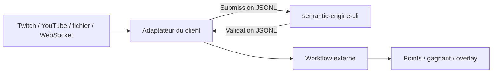

# Intégration locale JSONL

La CLI expose le moteur comme un **sidecar local générique** : tout client peut
garder le processus ouvert, écrire une soumission JSON par ligne sur l'entrée
standard et recevoir une validation JSON par ligne sur la sortie standard. Il
n'y a ni réseau, ni compte, ni coût par requête.

## Essai rapide

```powershell
Get-Content examples/submissions.jsonl |
  cargo run -q -p semantic-engine-cli -- validate --round examples/rounds/elden-ring.json
```

La sortie conserve l'ordre des entrées. `source_sequence` demeure inchangé : le
workflow appelant peut arbitrer le premier message accepté sans confondre
reconnaissance et attribution des points.

## Contrat

Les schémas stables sont dans :

- `contracts/submission.schema.json` ;
- `contracts/validation.schema.json` ;
- `contracts/operator-resolution.schema.json`.

La validation contient toujours l'identité du round, du message, du participant
et l'ordre fourni par la source. Le moteur ne déclare jamais un vainqueur.

Une application peut ensuite émettre une `OperatorResolution` à partir d'une
validation conservée côté backend. Sa clé d'idempotence est
`(round_id, message_id)` ; participant et ordre source sont recopiés depuis la
preuve backend, jamais depuis une requête d'arbitrage non fiable.



## Propriété de l'adaptateur

L'adaptateur spécifique appartient au client ou à un dépôt d'intégration séparé.
Semantic Engine ne doit importer ni son bus d'événements, ni ses types, ni ses
règles de score. Cette direction de dépendance garantit que l'application
portable reste complète quand aucun client externe n'est présent.

MyVault peut, par exemple, démarrer le sidecar, traduire ses messages de chat en
`Submission`, puis republier les `Validation` sur son propre bus. Il s'agit
d'un exemple de consommation, sans statut privilégié dans l'architecture.

## Évolution vers HTTP/WebSocket

Le sidecar JSONL est le transport public disponible aujourd'hui. Le futur
adaptateur HTTP/WebSocket local exposera les mêmes concepts et les mêmes schémas.
Un client pourra donc changer de transport sans déplacer la reconnaissance ou le
scoreboard.

Trois modes resteront possibles :

1. sidecar lancé par un client local ;
2. passerelle loopback activée explicitement dans l'application portable ;
3. hôte headless ou microservice lorsqu'un déploiement distant le justifie.

Le mode JSONL demeure pertinent pour les prototypes : faible latence, aucun port
réseau à sécuriser et diagnostic simple.
