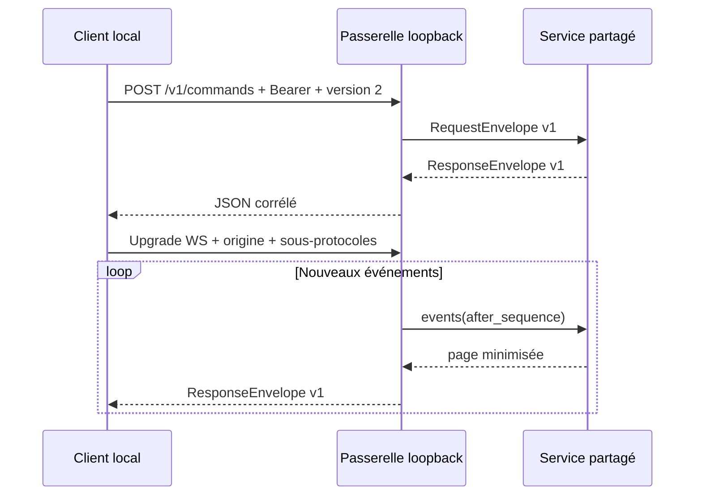

# API locale HTTP et WebSocket

La passerelle loopback expose le même protocole public v2 que le sidecar JSONL.
Elle est indépendante de Tauri, désactivée par défaut et ne peut écouter que sur
une adresse loopback. Son contrat source se trouve dans
`contracts/loopback-openapi.yaml` et les corps réutilisent les schémas JSON de
`contracts/`.

## Démarrage explicite

```powershell
cargo run -p semantic-engine-cli -- loopback --enable `
  --audit .\semantic-engine.sqlite3 `
  --sources .\semantic-engine.sources.sqlite3 `
  --port 17831 `
  --origin http://localhost:5173
```

Le premier objet JSON écrit sur stdout contient l'adresse effective, la version
et un jeton aléatoire éphémère de 256 bits. Le port `0` demande au système un port
libre. Ne pas placer le jeton dans une URL, un fichier versionné ou un log.

## Commandes HTTP

`POST /v1/commands` attend :

- `Authorization: Bearer <jeton>` ;
- `X-Semantic-Engine-Protocol: 2` ;
- une origine figurant dans l'allowlist si le client envoie `Origin` ;
- un corps conforme à `contracts/protocol-request.schema.json` et inférieur ou
  égal à 1 Mio.

```js
const response = await fetch(`${address}/v1/commands`, {
  method: "POST",
  headers: {
    Authorization: `Bearer ${token}`,
    "Content-Type": "application/json",
    "X-Semantic-Engine-Protocol": "2",
  },
  body: JSON.stringify({
    protocol_version: 2,
    request_id: crypto.randomUUID(),
    command: "stats",
  }),
});
```

Les erreurs métier restent des réponses corrélées HTTP 200 avec `status: error`.
Les erreurs de transport utilisent 400, 401, 403, 413, 415, 426, 429, 500 ou
503 et un objet `error` stable. `GET /v1/health` ne retourne ni donnée de session
ni secret.

## Sources d'entrée

Le même serveur expose la gestion des sources. Ces routes utilisent le même
Bearer éphémère, la même version de protocole, les mêmes origines, quotas et
limites de corps que `/v1/commands`.

| Opération | Route |
|---|---|
| lister | `GET /v1/sources` |
| ajouter Twitch | `POST /v1/sources/twitch` |
| commencer / interroger OAuth | `POST /v1/sources/{id}/authorization[/poll]` |
| tester | `POST /v1/sources/{id}/test` |
| écouter une session | `POST /v1/sources/{id}/start` |
| mettre en pause | `POST /v1/sources/{id}/pause` |
| supprimer | `DELETE /v1/sources/{id}?expected_revision=…` |

```js
const source = await fetch(`${address}/v1/sources/twitch`, {
  method: "POST",
  headers: {
    Authorization: `Bearer ${token}`,
    "Content-Type": "application/json",
    "X-Semantic-Engine-Protocol": "2",
  },
  body: JSON.stringify({
    display_name: "Mon canal",
    client_id: "identifiant-public-twitch",
  }),
}).then((response) => response.json());
```

Les réponses suivent `contracts/source-view.schema.json`. Elles peuvent contenir
un `credential_id` opaque et un booléen `authenticated`, mais jamais un access
token, refresh token ou code appareil interne. Le `user_code` retourné par le
Device Code Grant est volontairement visible par le client local authentifié et
expire rapidement. `expected_revision` impose un contrôle optimiste avant les
actions destructives.

Le contrat source v2 ajoute `runtime.fault = { code, retryable }` pour que les
clients distinguent une panne transitoire d’une action opérateur. La suppression
retourne un `SourceDeletionReceipt` confirmant séparément révocation distante,
purge du coffre et purge SQLite, sans secret.

### Migration source v1 → v2

- accepter `contract_version: 2` pour `input-source` et `source-view` ;
- lire `runtime.fault` au lieu d’interpréter librement `runtime.detail` ;
- après `DELETE`, attendre `200` et lire le reçu, au lieu d’attendre `204` ;
- aucune migration SQLite ni réautorisation n’est nécessaire : les définitions
  persistées sont relues avec le contrat courant et les jetons restent au coffre.

Cette migration de ressource était initialement indépendante du protocole de
commande. Depuis l'ajout de la mémoire, le protocole de commande est lui aussi en
v2 ; le [guide de migration](protocol-v2-migration.md) couvre cette seconde rupture.

## Événements WebSocket

Le client se connecte à
`/v1/events/ws?session_id=...&after_sequence=0&limit=100` et propose deux
sous-protocoles :

```js
const socket = new WebSocket(url, [
  "semantic-engine.v2",
  `semantic-engine.token.${token}`,
]);
```

Le serveur sélectionne uniquement `semantic-engine.v2`. Le second protocole sert
à authentifier les navigateurs, qui ne peuvent pas définir librement un header
`Authorization` pendant l'upgrade. Chaque message reçu est une enveloppe de
réponse v1 contenant une page d'événements. `after_sequence` permet la reprise
sans doublon après une reconnexion.



## Limites et modèle de sécurité

- bind non-loopback refusé par la bibliothèque ;
- jeton généré par le CSPRNG du système, comparé via son hash et jamais écrit en
  base ;
- aucune origine navigateur autorisée implicitement ; chaque origine est exacte
  et ajoutée explicitement, avec un CORS non permissif ;
- 100 requêtes/s, 32 requêtes en vol et 8 WebSockets par défaut ;
- refus immédiat sous charge, sans file non bornée ;
- pages d'événements limitées à 1 000 et polling interne borné ;
- aucun texte brut du chat ni expression correspondante dans les événements.

Ce transport n'est ni une API LAN ni une API Internet. La commande CLI `loopback`
constitue déjà un hôte headless local : elle assemble `semantic-engine-loopback`
et `semantic-engine-source-runtime`, les deux modules également utilisés par
Tauri. Un futur mode réseau devra rester distinct et ajouter TLS, identité
durable, rôles, rotation et observabilité adaptée.

## Conformité

```powershell
cargo build -p semantic-engine-cli
node conformance/clients/node-loopback-client.mjs target/debug/semantic-engine-cli.exe
```

Le client Node lance le binaire réel, vérifie auth, santé, HTTP, WebSocket,
idempotence et minimisation, puis confirme que SQLite ne contient pas le message
privé utilisé par le scénario.
