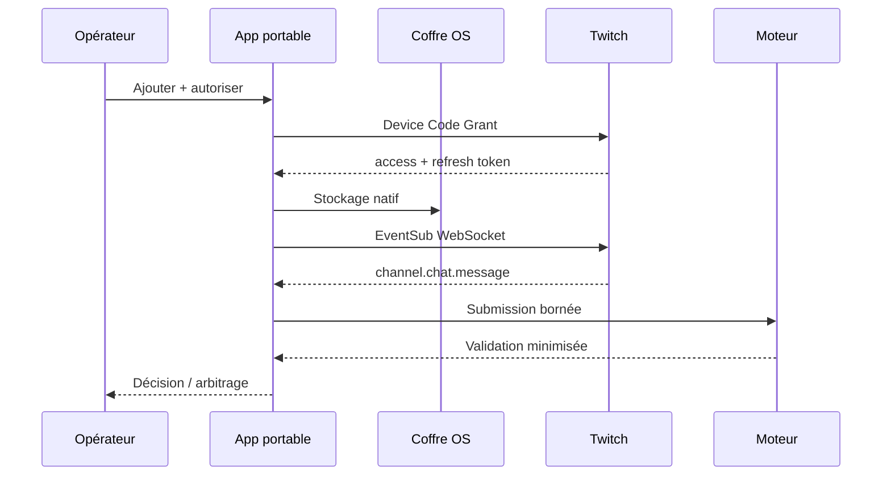

# Connecter un chat Twitch

L’adaptateur Twitch est facultatif : le moteur, les paquets de contexte et la
saisie manuelle continuent de fonctionner sans compte ni réseau. Quand il est
activé, il écoute `channel.chat.message` avec EventSub WebSocket et transforme
chaque message en `Submission` sans modifier le cœur de reconnaissance.

## Préparer une application Twitch

1. Créer une application depuis la [console Twitch Developers](https://dev.twitch.tv/console/apps).
2. Choisir un client **public** pour utiliser le Device Code Grant sans
   `client_secret` embarqué.
3. Copier son `Client ID`, qui est un identifiant public.
4. Dans Semantic Engine, ouvrir **Sources de chat**, saisir un nom et ce Client
   ID, puis choisir **Ajouter Twitch**.
5. Ouvrir le lien affiché, saisir le code à usage unique et consentir au scope
   minimal `user:read:chat`.

Le flux suit le [Device Code Grant officiel](https://dev.twitch.tv/docs/authentication/getting-tokens-oauth/#device-code-grant-flow).
Le code appareil reste uniquement en mémoire. Les jetons d’accès et de
renouvellement sont enregistrés dans le coffre natif du système, jamais dans
SQLite, les logs ou l’interface.

| Système | Coffre utilisé |
|---|---|
| Windows | Gestionnaire d’identifiants Windows |
| macOS | Trousseau d’accès |
| Linux | Secret Service du bureau |

Déplacer le dossier portable ne déplace volontairement pas les jetons : une
nouvelle machine ou un autre compte système doit être autorisé à nouveau.

## Lancer une partie

1. Configurer la réponse attendue ou choisir une cible du paquet actif.
2. Cliquer **Écouter** sur la source Twitch. Une session est créée si nécessaire.
3. Les compteurs de la source indiquent messages reçus et validations acceptées.
4. Une réponse live apparaît dans le panneau **Décision** sans son texte brut.
5. En cas d’abstention, utiliser **Arbitrage manuel** comme pour une saisie locale.
6. Cliquer **Pause** ou terminer la session pour arrêter immédiatement l’écoute.

## Reconnexion et limites

- une URL de reconnexion n’est acceptée que sur
  `eventsub.wss.twitch.tv` ;
- les frames et réponses HTTP sont bornées à 64 Kio ;
- les notifications répétées par Twitch sont dédupliquées dans une fenêtre
  bornée de 4 096 identifiants ;
- la file entre Twitch et le moteur est bornée à 256 événements ; une saturation
  arrête la source au lieu d’accumuler de la mémoire ;
- le jeton est validé au démarrage puis toutes les 55 minutes, conformément à
  l’[exigence Twitch de validation horaire](https://dev.twitch.tv/docs/authentication/validate-tokens/),
  et renouvelé avant expiration ;
- après une perte de socket ordinaire, Twitch ne rejoue pas les messages perdus.

Plusieurs sources peuvent alimenter la même session. Chaque adaptateur maintient
son ordre local ; juste avant la validation, `semantic-engine-source-runtime`
attribue sous verrou une `source_sequence` globale. La valeur suivante est
reconstruite depuis le journal durable de la session après un redémarrage. Deux
messages concurrents obtiennent donc toujours des positions distinctes et le
workflow de score peut consommer un ordre total.

## Confidentialité et suppression

Le texte transite en mémoire jusqu’au moteur puis est libéré. L’audit persiste
seulement identifiants, ordre, décision, cible, score et catégories de preuve.
Supprimer une source efface d’abord son jeton du coffre OS, puis sa configuration
SQLite avec `secure_delete`.

L’exploitant reste responsable de sa notice, de sa base légale, des demandes
d’effacement et du respect du [Twitch Developer Agreement](https://www.twitch.tv/p/en/legal/developer-agreement/).
Semantic Engine ne republie pas le chat et ne l’utilise pas pour entraîner un
modèle.
