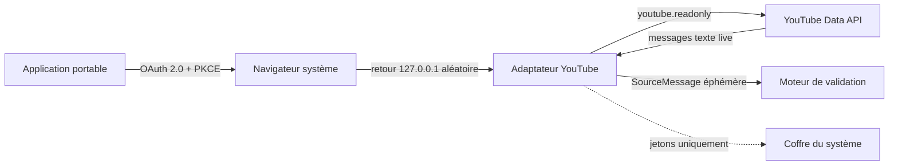

# Connecter un live YouTube

> Statut : adaptateur expérimental. La collecte technique est opérationnelle,
> mais l’usage public ou commercial des messages pour produire des verdicts,
> points ou classements doit être validé dans un **YouTube API Compliance Audit**.

## Ce que fait l’adaptateur



Le flux serveur officiel `streamList` gRPC transporte les messages ; REST sert
uniquement à découvrir l’identifiant du chat actif. Le premier lot gRPC sert de
baseline et n’est pas soumis au moteur : une
réponse envoyée avant le démarrage du round ne peut donc pas gagner. Les lots
suivants sont dédupliqués dans une fenêtre mémoire bornée, ordonnés avec les
autres sources, puis oubliés après validation. Aucun chat brut n’est conservé.

## Préparer Google Cloud

1. créer ou sélectionner un projet Google Cloud ;
2. activer **YouTube Data API v3** ;
3. configurer l’écran de consentement et sa politique de confidentialité ;
4. créer un identifiant OAuth de type **Desktop app** ;
5. copier le `Client ID` public se terminant par `.apps.googleusercontent.com`.

Un secret client n’est ni demandé ni embarqué : une application desktop ne peut
pas le garder confidentiel. L’application ouvre le navigateur avec PKCE S256,
un `state` aléatoire et un port loopback éphémère. Elle demande uniquement
`youtube.readonly`, stocke les jetons dans le coffre natif, les rafraîchit avant
expiration et tente leur révocation lors de la suppression de la source.

## Ajouter la source

Dans **Sources de chat** :

1. choisir **YouTube Live (expérimental)** ;
2. saisir le Client ID Desktop et l’ID de vidéo à 11 caractères ;
3. lire puis cocher la reconnaissance des règles YouTube API ;
4. terminer l’autorisation Google dans le navigateur ;
5. tester la source, puis cliquer sur **Écouter** pendant une session active.

La vidéo doit être live et exposer un chat actif. Une URL complète n’est pas
acceptée afin de garder la configuration non ambiguë : utilisez seulement la
valeur après `v=` ou après `youtu.be/`.

La collecte peut être configurée et testée normalement, mais l’envoi des messages
au moteur est **désactivé par défaut dans la distribution**. Pour un test de
conformité approuvé, lancer l’application avec
`SEMANTIC_ENGINE_ENABLE_YOUTUBE_DERIVED_DATA=1`. Le consentement affiché dans
l’interface ne remplace pas ce verrou de distribution.

## API locale/headless

La création utilise `POST /v1/sources/youtube` :

```json
{
  "display_name": "Live cinéma",
  "client_id": "123.apps.googleusercontent.com",
  "video_id": "dQw4w9WgXcQ",
  "policy_acknowledged": true
}
```

Les routes génériques `/authorization`, `/authorization/poll`, `/test`, `/start`,
`/pause` et `DELETE /v1/sources/{source_id}` dispatchent ensuite selon
l’adaptateur. L’authentification bearer et l’en-tête de version du protocole
restent obligatoires. Aucune réponse publique ne contient de jeton.

## Limites et conformité

- Le transport utilise `streamList` gRPC. Le page token est enregistré dans la
  base locale seulement après traitement du lot, puis réutilisé après une coupure
  ou un redémarrage. Les erreurs transitoires sont temporisées par un backoff
  exponentiel plafonné ; une fin de live passe proprement la source en pause. Une
  mesure avec un live YouTube réel reste nécessaire pour publier p50/p95/p99 réseau.
- YouTube limite la conservation et interdit plusieurs formes de données
  dérivées ou de fusion inter-plateformes. Les scores/verdicts doivent rester
  désactivables et documentés dans la demande d’audit de conformité.
- Une autorisation de test Google peut expirer rapidement ; l’application traite
  la réauthentification comme un état normal.
- Les quotas et refus API sont des fautes de source, jamais des raisons de
  contourner les intervalles conseillés.

La justification détaillée et les références officielles sont dans
[Recherche YouTube Live](../research/youtube-live-integration.md).
