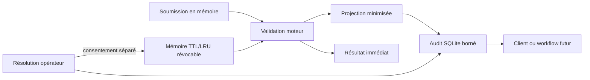

# Audit local et confidentialité

Semantic Engine conserve un journal minimal pour que la validation reste utile
après un redémarrage et puisse alimenter plus tard un scoreboard, un sidecar ou
une API. Ce journal appartient au produit autonome : il ne dépend ni de Tauri,
ni de Twitch, ni de MyVault.

## Ce qui est conservé

Chaque entrée associe de façon immuable :

- l’identité `(round_id, message_id)` et l’ordre `source_sequence` ;
- l’identifiant du participant fourni par la source ;
- la décision moteur, la cible éventuelle, le score et les catégories de preuve ;
- l’empreinte du paquet de contexte lorsqu’une future session en fournit une ;
- la résolution opérateur éventuelle et sa note explicite ;
- un ordre local et les dates d’enregistrement.

Le schéma public versionné est `contracts/audit-entry.schema.json` à la racine du
dépôt. Un même couple `(round_id, message_id)` rejoué avec le même contenu est
idempotent. Un contenu différent est refusé au lieu de réécrire l’historique.

## Ce qui n’est pas conservé

Le journal ne stocke jamais le texte brut de la soumission. Il retire également
`matched_expression`, car cette preuve peut contenir une copie de la formulation
du participant. Il ne désigne pas de gagnant et ne calcule aucun point.

`participant_id` reste une donnée potentiellement personnelle ou pseudonyme. Un
adaptateur de source doit documenter sa provenance et appliquer les obligations
appropriées avant une utilisation publique ou commerciale.

## Mémoire opt-in distincte

La mémoire de reconnaissance est séparée de l'audit. Elle ne reçoit une
formulation que si l'opérateur a d'abord enregistré une résolution acceptée,
puis consenti explicitement à apprendre le texte affiché. Elle conserve la
formulation, sa forme normalisée, la cible, le SHA-256 du paquet, les dates,
l'usage et une empreinte non réversible de la résolution. Elle ne conserve ni
participant, ni identifiant de message ou de session en clair.
La commande de consentement ne transporte pas la formulation : le backend reprend
sa copie transitoire et associe à chaque entrée un identifiant opaque aléatoire et
une version du normaliseur.

La configuration locale limite cette mémoire à 1 000 entrées actives et 30 jours.
Les expirations, évictions LRU et révocations restent dans un historique technique
borné. L'application liste jusqu'à 1 000 entrées actives afin qu'elles restent
toutes révocables ; l'API expose le même filtre et inclut l'historique borné par
défaut. La révocation exige l'identifiant opaque et le SHA-256 du contexte. Ces opérations sont disponibles dans le
protocole local, authentifié lorsqu'il passe par l'API loopback. Une répétition
de chat, une résolution rejetée ou une
session sans contexte fingerprinté ne peuvent pas créer d'entrée.
Le service exige que le message source soit encore présent en mémoire vive et en
reprend lui-même la formulation. Ce texte transitoire n'est pas restauré depuis SQLite :
après un redémarrage, un ancien arbitrage reste valide mais ne peut plus apprendre
rétroactivement une formulation fournie par le client.

## Rétention et suppression

La configuration locale actuelle conserve au maximum 10 000 validations et 30
jours. Le nettoyage est appliqué à chaque nouvelle validation ; l’âge maximal
n’est donc pas un minuteur d’effacement en arrière-plan. Les résolutions sont
supprimées en cascade avec leur validation.

Dans l’application, **Tout effacer** ouvre une confirmation détaillée puis purge
sessions, validations, arbitrages et mémoire dans une transaction SQLite unique ;
une compaction best-effort suit le commit avec l’effacement sécurisé activé, sans
jamais remettre en cause une purge déjà validée. L’écran ne
réaffiche que les huit entrées les plus récentes et
signale explicitement que leur entrée textuelle n’a pas été conservée.

## Emplacement et portabilité

Le fichier `audit.sqlite3` se trouve dans le répertoire de données local de
l’application, à côté de `contexts.sqlite3`, pas dans le dossier de l’exécutable.
Le module `semantic-engine-audit-store` peut être réutilisé par un hôte headless
ou un autre transport sans lancer la WebView.

Le même fichier contient des tables séparées gérées par
`semantic-engine-session-store`. Elles conservent la définition de la manche,
les événements minimisés et des empreintes SHA-256 pour détecter un rejeu
contradictoire après redémarrage. Le texte soumis n’y est jamais écrit. Effacer
le journal depuis l’application purge ensemble audit, sessions et mémoire afin de
ne laisser ni identifiants orphelins ni formulations apprises.

