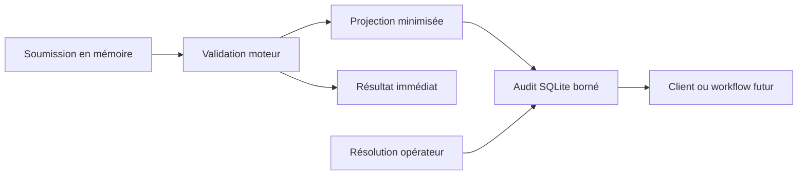

# Audit local et confidentialité

Semantic Engine conserve un journal minimal pour que la validation reste utile
après un redémarrage et puisse alimenter plus tard un scoreboard, un sidecar ou
une API. Ce journal appartient au produit autonome : il ne dépend ni de Tauri,
ni de Twitch, ni de MyVault.

## Ce qui est conservé

Chaque entrée associe de façon immuable :

- l’identité `(round_id, message_id)` et l’ordre `source_sequence` ;
- l’identifiant du participant fourni par la source ;
- la décision moteur, la cible éventuelle, le score et les catégories de preuve ;
- l’empreinte du paquet de contexte lorsqu’une future session en fournit une ;
- la résolution opérateur éventuelle et sa note explicite ;
- un ordre local et les dates d’enregistrement.

Le schéma public versionné est `contracts/audit-entry.schema.json` à la racine du
dépôt. Un même couple `(round_id, message_id)` rejoué avec le même contenu est
idempotent. Un contenu différent est refusé au lieu de réécrire l’historique.

## Ce qui n’est pas conservé

Le journal ne stocke jamais le texte brut de la soumission. Il retire également
`matched_expression`, car cette preuve peut contenir une copie de la formulation
du participant. Il ne désigne pas de gagnant et ne calcule aucun point.

`participant_id` reste une donnée potentiellement personnelle ou pseudonyme. Un
adaptateur de source doit documenter sa provenance et appliquer les obligations
appropriées avant une utilisation publique ou commerciale.

## Rétention et suppression

La configuration locale actuelle conserve au maximum 10 000 validations et 30
jours. Le nettoyage est appliqué à chaque nouvelle validation ; l’âge maximal
n’est donc pas un minuteur d’effacement en arrière-plan. Les résolutions sont
supprimées en cascade avec leur validation.

Dans l’application, **Effacer** ouvre une confirmation puis purge et compacte le
journal SQLite entier avec l’effacement sécurisé SQLite activé. L’écran ne
réaffiche que les huit entrées les plus récentes et
signale explicitement que leur entrée textuelle n’a pas été conservée.

## Emplacement et portabilité

Le fichier `audit.sqlite3` se trouve dans le répertoire de données local de
l’application, à côté de `contexts.sqlite3`, pas dans le dossier de l’exécutable.
Le module `semantic-engine-audit-store` peut être réutilisé par un hôte headless
ou un autre transport sans lancer la WebView.

