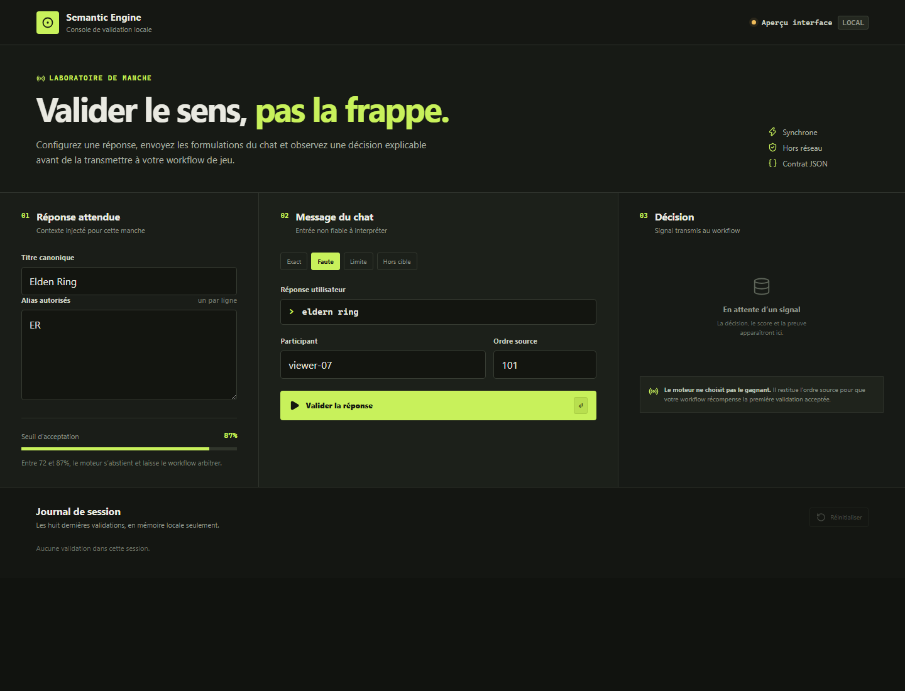
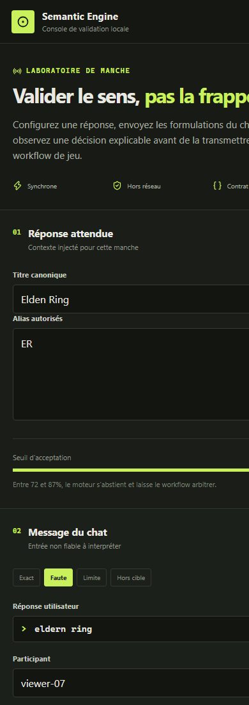

# Application portable

Le client bureau est une application **Tauri 2 + Svelte 5**. Le moteur Rust est
appelé directement par IPC : aucune API distante, aucun serveur local et aucune
clé ne sont nécessaires pour valider une réponse.

## Deux distributions portables

### Légère

Distribuer `semantic-engine-desktop.exe` seul. Il utilise WebView2 déjà présent
sur Windows 10/11. C’est le chemin prioritaire pour les tests et les pilotes :
un fichier à copier, aucun installateur.

### Hors ligne stricte

Distribuer l’exécutable avec une version fixe de WebView2. Ce mode fonctionne
sans composant préinstallé mais ajoute environ 180 Mo. Le runtime Microsoft doit
être téléchargé au moment de préparer la release, puis son chemin déclaré avec
`webviewInstallMode.type = "fixedRuntime"`.

La CI devra produire les deux variantes et publier leur somme SHA-256.

## Construire

Prérequis de développement Windows : Rust MSVC, Microsoft C++ Build Tools,
Windows SDK, Node.js et WebView2.

```powershell
cd apps/desktop
npm install
npm run check
npm run tauri -- build --no-bundle
```

Sortie : `target/release/semantic-engine-desktop.exe`.

## Interface

La console suit le parcours d’une régie de direct :

1. configurer le titre canonique et ses alias ;
2. injecter un message non fiable ;
3. lire la décision, le score, la preuve et la latence ;
4. observer le journal éphémère de la session.



??? example "Aperçu étroit"

    L’interface devient un parcours vertical sans perdre la décision principale.

    

Elle ne contient volontairement ni points, ni classement, ni connexion Twitch.
Ces consommateurs reçoivent le contrat `Validation` sans modifier le moteur.

## Sécurité par défaut

- politique CSP restrictive ;
- capability Tauri limitée à `core:default` ;
- aucun accès fichier, shell ou réseau exposé au frontend ;
- longueur des champs bornée côté UI et dans le moteur ;
- journal conservé en mémoire seulement pour ce premier incrément.

## Prochain durcissement

- valider les limites dans le cœur Rust, pas seulement dans l’UI ;
- signer le binaire et publier SBOM + checksums ;
- tester sur une machine Windows propre ;
- proposer le runtime WebView2 fixe pour le paquet hors ligne ;
- ajouter le sélecteur graphique au mécanisme d’import de contexte déjà disponible en CLI ;
- mesurer p50/p95/p99 sur le corpus cible.

## Référence Tauri

La documentation Tauri décrit les modes WebView2 `skip`, `offlineInstaller` et
`fixedRuntime`, ainsi que leur compromis taille/autonomie :
<https://v2.tauri.app/distribute/windows-installer/>.
