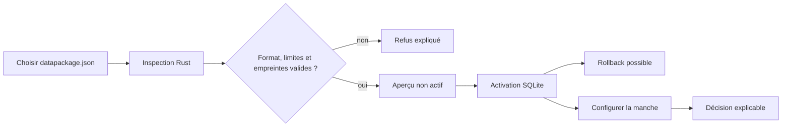

# Application portable

Le client bureau est une application **Tauri 2 + Svelte 5**. Le moteur Rust est
appelé directement par IPC : aucune API distante, aucun serveur local et aucune
clé ne sont nécessaires pour valider une réponse.

## Deux distributions portables

### Légère

Distribuer `semantic-engine-desktop.exe` seul. Il utilise WebView2 déjà présent
sur Windows 10/11. C’est le chemin prioritaire pour les tests et les pilotes :
un fichier à copier, aucun installateur.

### Hors ligne stricte

Distribuer l’exécutable avec une version fixe de WebView2. Ce mode fonctionne
sans composant préinstallé mais ajoute environ 180 Mo. Le runtime Microsoft doit
être téléchargé au moment de préparer la release, puis son chemin déclaré avec
`webviewInstallMode.type = "fixedRuntime"`.

La CI devra produire les deux variantes et publier leur somme SHA-256.

## Construire

Prérequis de développement Windows : Rust MSVC, Microsoft C++ Build Tools,
Windows SDK, Node.js et WebView2.

```powershell
cd apps/desktop
npm install
npm run check
npm run tauri -- build --no-bundle
Copy-Item ..\..\target\release\semantic-engine-desktop.exe ..\..\SemanticEngine.exe -Force
```

Sortie de compilation : `target/release/semantic-engine-desktop.exe`.
La livraison locale place aussi une copie nommée `SemanticEngine.exe` à la
racine du dépôt : c’est le point d’entrée portable destiné à l’opérateur. Cette
copie est un artefact généré et reste ignorée par Git.

## Interface

La console suit le parcours d’une régie de direct :

1. sélectionner un `datapackage.json` et contrôler son aperçu ;
2. vérifier identité, version, licence, langues, provenance et empreinte ;
3. activer explicitement le paquet ou restaurer la version précédente ;
4. configurer le titre canonique et ses alias pour la manche ;
5. injecter un message non fiable ;
6. lire la décision, le score, la preuve et la latence ;
7. observer le journal éphémère de la session.



Sous 700 px, ces zones deviennent un parcours vertical dans le même ordre ;
l’état « non actif » reste visible avant la configuration de manche.

Elle ne contient volontairement ni points, ni classement, ni connexion Twitch.
Ces consommateurs reçoivent le contrat `Validation` sans modifier le moteur.

## Sécurité par défaut

- politique CSP restrictive ;
- capabilities Tauri limitées à `core:default` et `dialog:allow-open` ;
- aucun accès générique aux fichiers, au shell ou au réseau exposé au frontend ;
- le dialogue fournit seulement le chemin choisi ; le backend Rust canonise,
  borne, parse et vérifie le paquet avant de retourner des métadonnées ;
- le frontend ne reçoit aucune capability d’écriture : seul le backend ouvre SQLite ;
- l’activation est refusée si le paquet ne correspond plus à l’empreinte inspectée ;
- activation et rollback utilisent une transaction immédiate et des versions immuables ;
- longueur des champs bornée côté UI et dans le moteur ;
- journal conservé en mémoire seulement pour ce premier incrément.

## Prochain durcissement

- valider les limites dans le cœur Rust, pas seulement dans l’UI ;
- signer le binaire et publier SBOM + checksums ;
- tester sur une machine Windows propre ;
- proposer le runtime WebView2 fixe pour le paquet hors ligne ;
- rendre les cibles du contexte actif sélectionnables par un round ;
- mesurer p50/p95/p99 sur le corpus cible.

## Référence Tauri

La documentation Tauri décrit les modes WebView2 `skip`, `offlineInstaller` et
`fixedRuntime`, ainsi que leur compromis taille/autonomie :
<https://v2.tauri.app/distribute/windows-installer/>.
