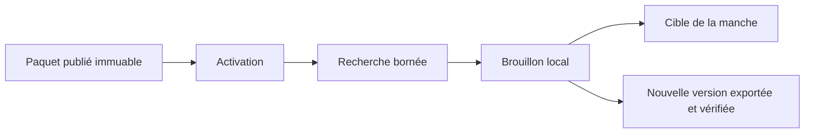

# Application portable

Le client bureau est une application **Tauri 2 + Svelte 5**. Le moteur Rust est
appelé directement par IPC : aucun serveur local, service distant ou clé API
n’est nécessaire pour valider une réponse.

## Lancer sans installation

Depuis la racine du dépôt, double-cliquer sur **`SemanticEngine Portable.cmd`**.
Ce lanceur ouvre `portable/SemanticEngine/Start-SemanticEngine.cmd`, applique les
droits Windows nécessaires au runtime fixe, puis démarre l’application.

Le dossier `portable/SemanticEngine` est autonome : il contient l’exécutable, le
runtime WebView2 et `SHA256SUMS.txt`. Il ne doit pas être lancé depuis un partage
réseau ou un chemin UNC. Les données opérateur restent dans l’AppData Windows ;
déplacer le dossier portable ne déplace donc pas le contexte actif ni les
brouillons locaux. Les jetons de plateformes restent dans le coffre du compte
Windows et ne suivent pas non plus le dossier : c’est intentionnel, une nouvelle
machine exige une nouvelle autorisation.

## Deux distributions

### Légère

`SemanticEngine.exe` à la racine utilise le runtime WebView2 déjà installé sur
Windows. Cette variante est petite et pratique sur une machine moderne, mais
elle n’est pas autonome sur un Windows dépourvu de WebView2.

### Hors ligne stricte

`SemanticEngine Portable.cmd` utilise exclusivement le runtime WebView2 Fixed
Version placé à côté de l’exécutable. Le package validé contient la version
`150.0.4078.105` x64 et pèse environ 690 Mo une fois extraite. Le runtime est
verrouillé par version, URL officielle et SHA-256 dans
`scripts/webview2-runtime.json`.

Microsoft indique que Fixed Version doit être distribué avec l’application, que
son volume dépasse 250 Mo et qu’une app non empaquetée sur Windows 10 peut devoir
accorder des ACL au runtime. Le lanceur fourni applique ces ACL aux deux SID
Microsoft documentés. Les chemins réseau ne sont pas supportés.

## Construire la portable hors ligne

Prérequis : Rust MSVC, Microsoft C++ Build Tools, Windows SDK, Node.js et le CAB
WebView2 exact référencé par `scripts/webview2-runtime.json`.

```powershell
.\scripts\build-portable.ps1 `
  -WebView2Cab C:\tmp\Microsoft.WebView2.FixedVersionRuntime.150.0.4078.105.x64.cab
```

Le script :

1. vérifie le nom et le SHA-256 du CAB ;
2. extrait le runtime dans un dossier temporaire ;
3. exécute `npm ci` et le build Svelte dans une copie temporaire gouvernée par
   `package-lock.json`, sans dépendre du `node_modules` de travail ;
4. compile la variante Tauri fixe avec `tauri.portable.conf.json`, puis la
   variante légère utilisant WebView2 système ;
5. génère le dossier portable, la variante légère racine, le lanceur et les checksums ;
6. retire systématiquement le lien de build et le dossier temporaire.

Il refuse d’écraser un package existant. Déplacer ou supprimer explicitement
`portable/SemanticEngine` avant une nouvelle génération.

## Voir et régler le dictionnaire

Dans le produit, le « dictionnaire » est un **paquet de contexte** versionné.
L’opérateur suit ce parcours :

1. **Choisir `datapackage.json`**, vérifier l’aperçu, puis **Activer ce paquet** ;
2. ouvrir **Voir et régler le dictionnaire** ;
3. rechercher un titre ou un alias ; seuls 25 résultats sont rendus ;
4. sélectionner une cible ;
5. modifier le titre canonique et les alias, un alias par ligne ;
6. **Enregistrer localement** pour conserver le réglage après redémarrage ;
7. **Utiliser pour la manche** pour injecter immédiatement cette cible dans le round ;
8. saisir une version supérieure, puis **Exporter le paquet** et choisir son dossier parent ;
9. réimporter le `datapackage.json` affiché ou publier ce nouveau paquet ;
10. **Revenir au publié** pour supprimer un brouillon local devenu inutile.

Le paquet publié n’est jamais modifié. Les réglages sont un calque SQLite local,
indexé par empreinte du paquet et identifiant de cible. L’export fusionne ce calque
dans une nouvelle version, recalcule ses empreintes, embarque ses profils et la
valide avant de rendre le dossier final visible. Il refuse une version non
supérieure et n’écrase jamais une destination existante.
Les exports incluent README, notice de licence, checksums et schéma Data Package v2
pour une validation hors ligne. Les petits fichiers locaux de licence et de
provenance référencés par le manifeste sont conservés sans accepter de chemin hors
du paquet. Si l’application demande une mise à niveau des métadonnées, réactiver
simplement le paquet original puis relancer l’export ; les brouillons sont conservés.



## Connecter une webapp locale

Le panneau **API HTTP et WebSocket**, en bas de l'application, affiche d'abord
**Aucun port réseau ouvert**. Pour connecter une webapp :

1. saisir un port local, ou `0` pour choisir automatiquement un port libre ;
2. saisir l'origine exacte du client, par exemple `http://localhost:5173` ;
3. cliquer **Activer explicitement** ;
4. copier l'adresse et le jeton éphémère masqué ;
5. configurer le client avec le protocole v1 décrit dans le guide de
   [l'API locale](../integration/loopback-api.md) ;
6. cliquer **Désactiver** dès que l'intégration n'est plus utilisée.

La passerelle partage exactement le même service et la même session que
l'interface Tauri. Elle ne peut écouter que sur `127.0.0.1`, n'autorise aucune
origine web par défaut et reçoit une nouvelle clé à chaque activation ou
redémarrage. Elle expose aussi les sources et leurs actions via `/v1/sources`,
en utilisant le même orchestrateur que l'écran Tauri sans sérialiser de jeton
Twitch. L'application reste entièrement utilisable sans l'activer.

## Connecter Twitch

Le panneau **Sources de chat** permet d’ajouter plusieurs configurations Twitch,
de les autoriser avec un code appareil, de tester le compte, puis d’en activer
une pour la session courante. Aucun `client_secret` n’est demandé : seule la
valeur publique `Client ID` de l’application Twitch est saisie.

Une source active affiche son état de connexion, le nombre de messages remis au
moteur et le nombre d’acceptations. Les validations live alimentent le panneau
**Décision** et restent arbitrables. **Pause**, **Terminer la session** ou
**Supprimer** arrêtent l’écoute ; la suppression retire aussi le jeton du coffre
système. Le parcours détaillé et les limites v1 sont dans
[Connecter un chat Twitch](../integration/twitch.md).

## Arbitrer une validation

Après **Valider la réponse**, la carte conserve la décision, le score et la
preuve produits par le moteur. Le bloc **Arbitrage manuel** permet ensuite :

- d’accepter la soumission en choisissant une cible appartenant au round ;
- de la rejeter ;
- d’ajouter une note facultative limitée à 512 caractères.

La décision moteur originale n’est jamais écrasée. La résolution opérateur
contient aussi `round_id`, `message_id`, `participant_id` et `source_sequence`,
ce qui permet à un workflow externe de compter les points ou de désigner un
gagnant de façon idempotente. Validation et résolution sont persistées dans un
journal SQLite séparé, relu au redémarrage. Le texte brut et l’expression exacte
ayant servi de preuve ne sont pas conservés. L’écran permet de supprimer tout le
journal après confirmation ; voir [Audit local et confidentialité](audit.md).

## Sécurité par défaut

- CSP restrictive et aucune capability shell exposée au frontend ;
- dialogue de fichier limité, puis canonisation et validation Rust ;
- limites appliquées côté moteur aux messages, titres, alias, recherches et notes ;
- cible d’une acceptation opérateur obligatoirement présente dans le round ;
- identité participant/ordre recopiée depuis la validation conservée côté backend ;
- audit borné à 10 000 validations et 30 jours, sans texte brut du chat ;
- paramètres de source sans secret, jetons Twitch dans le coffre OS et validation horaire ;
- paquet publié immuable, activation transactionnelle et rollback SQLite ;
- recherche bornée et brouillons chargés en une requête groupée ;
- checksums de tous les fichiers de la distribution portable.

## Prochain durcissement

- signer les binaires et publier SBOM + checksums dans une release ;
- automatiser le test sur une machine Windows propre ;
- valider le Device Code Grant avec un Client ID de distribution et un pilote réel ;
- mesurer p50/p95/p99 sur des corpus de 500 à 50 000 cibles.

## Références

- [Tauri — Windows Installer / WebView2](https://v2.tauri.app/distribute/windows-installer/)
- [Microsoft — Distribute your app and the WebView2 Runtime](https://learn.microsoft.com/en-us/microsoft-edge/webview2/concepts/distribution)
