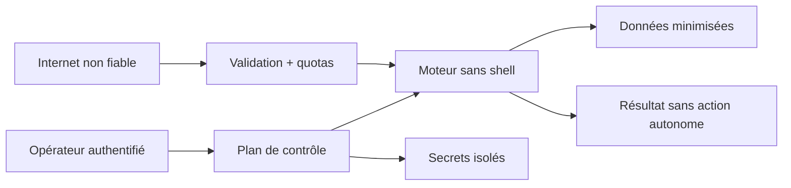

# Sécurité, safety et cadre légal

> Checklist produit, pas avis juridique. Faire valider usages, pays, plateformes
> et durées de conservation avant commercialisation.

Tout message, webhook, fichier, correction, plateforme et modèle est non fiable.
Un message ne devient jamais une commande système.

## Contrôles prioritaires

| Menace | Contrôle |
|---|---|
| taille, Unicode, fréquence | limites, timeout, file bornée, backpressure |
| webhook faux ou rejoué | signature, timestamp, nonce, idempotence |
| token OAuth volé | hors logs, coffre, rotation et révocation |
| accès à un autre contexte | autorisation par objet, identifiants opaques |
| mémoire empoisonnée | correction opérateur, revue, test, rollback |
| fuite par télémétrie | aucun contenu par défaut, redaction structurée |
| SSRF lors d’un ajout de source | schémas/hôtes autorisés, contrôle IP |
| dépendance ou modèle compromis | lockfile, SBOM, hash et provenance |
| décision à fort impact | abstention et confirmation humaine |

Tester l’API contre l’[OWASP API Security Top 10](https://owasp.org/www-project-api-security/).

## Auth

En local : réseau désactivé par défaut, bind loopback imposé, secret éphémère
généré par le système, allowlist d'origines et action explicite pour démarrer la
passerelle. Le jeton n'est ni persisté ni placé dans une URL ; l'application
desktop le garde en mémoire, le masque par défaut et permet de le copier pour un
client local. En équipe : OpenID Connect, rôles
`viewer/operator/owner`, OAuth plateforme séparé, scopes minimaux et journal des
changements sans contenu intégral du chat.

Les routes `/v1/sources` renvoient uniquement configuration publique, état
d'exécution, référence opaque de coffre et prompt Device Code temporaire. Les
access/refresh tokens ne traversent ni HTTP, ni IPC, ni les schémas publics.

Pour Twitch, l’application utilise un client public et le Device Code Grant :
aucun `client_secret` n’est distribué. Access/refresh tokens vivent dans le
coffre natif du système et leurs buffers sont masqués/effacés en mémoire. Le
produit valide le jeton au démarrage puis toutes les 55 minutes, le renouvelle
avant expiration, limite les hôtes OAuth/EventSub et permet de supprimer le
jeton avec la source. Voir [Connecter un chat Twitch](../integration/twitch.md).

Pour YouTube, l’application utilise OAuth Desktop avec PKCE S256, un `state`
aléatoire et un retour exclusivement loopback. Elle n’embarque aucun secret
client, demande `youtube.readonly`, baseline les messages antérieurs au round et
tente de révoquer le jeton avant suppression locale. L’exploitation publique de
verdicts ou points reste feature-gated jusqu’à validation du cas dans un YouTube
API Compliance Audit. Voir [Connecter un live YouTube](../integration/youtube.md).

La suppression d’une source tente la révocation officielle chez Twitch ou
Google, puis supprime toujours le secret du coffre natif et l’état SQLite local.
Un reçu minimisé expose `succeeded`, `failed` ou `not_applicable` pour la
révocation distante et confirme séparément les purges locales, sans jeton.

## Safety

Une faible confiance produit une abstention. Les sanctions, paiements, diagnostics,
profilages ou refus de droit exigent politique dédiée et validation humaine.
Prévoir sandbox, rollback et arrêt immédiat des sources.

## Données et droit

Messages, pseudonymes et identifiants peuvent être personnels. Le [RGPD article
5](https://eur-lex.europa.eu/eli/reg/2016/679/art_5/oj) exige notamment finalité,
minimisation, durée limitée, sécurité et responsabilité démontrable. Documenter
base légale, notice, durées, export/effacement, transferts et besoin d’AIPD.

Le produit applique déjà une première minimisation : l’audit local exclut le
texte du chat et l’expression correspondante, conserve les identifiants, scores
et verdicts pendant au plus 30 jours ou 10 000 validations, et offre une purge
totale confirmée. Cette valeur technique par défaut ne remplace pas le choix
d’une durée adaptée à la finalité ni les obligations de la plateforme. Voir
[Audit local et confidentialité](audit.md).

Twitch recommande [EventSub et Twitch API](https://dev.twitch.tv/docs/chat/) ;
les WebSockets conviennent au local et les scopes sont détaillés dans
[l’authentification chat](https://dev.twitch.tv/docs/chat/authenticating/).
L’exploitant doit aussi suivre le [Developer Agreement Twitch](https://www.twitch.tv/p/en/legal/developer-agreement/),
les changements d’API et les demandes de suppression. Twitch exige la
[validation horaire des jetons](https://dev.twitch.tv/docs/authentication/validate-tokens/),
contrainte appliquée par le superviseur local.

YouTube propose `liveChatMessages.streamList` dans la [documentation Live
Chat](https://developers.google.com/youtube/v3/live/docs/liveChatMessages). Ses
[Developer Policies](https://developers.google.com/youtube/terms/developer-policies)
imposent transparence, contrôle utilisateur et des limites de stockage/rafraîchissement
pouvant atteindre 30 jours selon la donnée.

Évaluer l’[AI Act européen](https://eur-lex.europa.eu/eli/reg/2024/1689/oj) selon
les fonctions réelles. Vérifier aussi licence et redistribution des modèles,
choisir la licence du dépôt avant contribution externe et respecter les marques.

Avant release : threat model, tests d’abus, inventaire des données, suppression,
procédure d’incident, politiques plateforme à jour et avis juridique ciblé.
