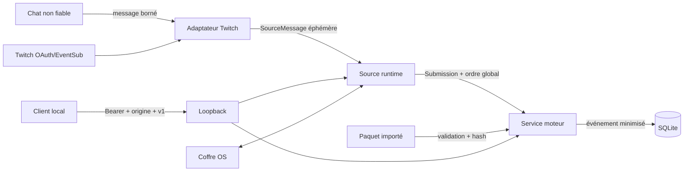

# Threat model

Ce document décrit le produit local et portable `v0.1`. Il ne transforme pas la
passerelle loopback en service LAN/Internet.

## Actifs et frontières de confiance

| Actif | Où il vit | Exigence |
|---|---|---|
| access/refresh token Twitch | coffre natif OS | confidentialité, suppression |
| Bearer loopback | mémoire du processus | confidentialité, rotation à chaque activation |
| texte du chat | mémoire transitoire | jamais dans audit/statut/log |
| session, ordre, verdict | SQLite local | intégrité, idempotence, reprise |
| paquet de contexte | fichiers importés | provenance, licence, taille, hash |

Les frontières sont : utilisateur/chat non fiable → adaptateur ; Twitch → OAuth
et WebSocket ; navigateur local → loopback ; paquet externe → importeur ; UI →
commandes Tauri ; runtime portable → OS et coffre natif.

## Menaces et contrôles

| Menace | Contrôle actuel | Risque résiduel |
|---|---|---|
| message énorme, spam, Unicode hostile | limites, normalisation, quotas, files bornées, backpressure | saturation CPU dans les limites autorisées |
| prompt injection dans le chat | aucun LLM ni outil n'interprète le texte ; traitement comme donnée | futurs modèles devront conserver cette frontière |
| vol de jeton via base/log/UI/API | coffre OS, types redacted, zeroize, réponses publiques sans token | malware du même compte OS |
| CSRF ou client web non autorisé | Bearer aléatoire, origine exacte, CORS fermé, loopback uniquement | extension/navigateur compromis avec accès au Bearer |
| serveur exposé sur LAN | validation stricte de l'adresse loopback | tunnel/proxy explicitement installé par l'utilisateur |
| paquet malveillant | chemins canoniques, tailles, nombre de fichiers, SHA-256, schéma, transaction | données légalement douteuses mais techniquement valides |
| relecture/doublon Twitch | ID de notification bornés, message ID namespacé, idempotence | Twitch ne rejoue pas les messages perdus hors connexion |
| ordre concurrent incorrect | séquence globale sous verrou, valeur suivante reconstruite du journal | ordre reflète l'arrivée locale, pas l'horodatage absolu réseau |
| suppression partielle | secret supprimé avant configuration, SQLite `secure_delete` | sauvegardes OS externes au produit |
| DLL/runtime substitué | checksums du paquet portable et WebView2 fixé | binaires non encore signés |
| dépendance compromise | lockfiles, CI, SBOM CycloneDX | absence initiale de signature/SLSA |

## Abus métier et légalité

Le moteur valide une réponse ; il ne paie pas un prix, ne bannit pas une personne
et ne désigne pas seul un gagnant. Le consommateur doit traiter les événements de
façon idempotente, définir ses règles et conserver une voie d'arbitrage. Un
exploitant informe les participants, choisit une base légale, respecte les
conditions Twitch et répond aux demandes d'effacement.

## Hors périmètre v0.1

- écoute sur une interface non loopback ;
- compte cloud, multi-tenant ou contrôle de rôles ;
- protection contre un administrateur/malware local ;
- disponibilité de Twitch ou récupération des messages non livrés ;
- garantie juridique sur un corpus importé par l'utilisateur.

Toute évolution LAN/cloud nécessite un threat model séparé avec TLS, identité
durable, rotation, autorisation par rôle, journaux d'administration et isolation
des locataires.
