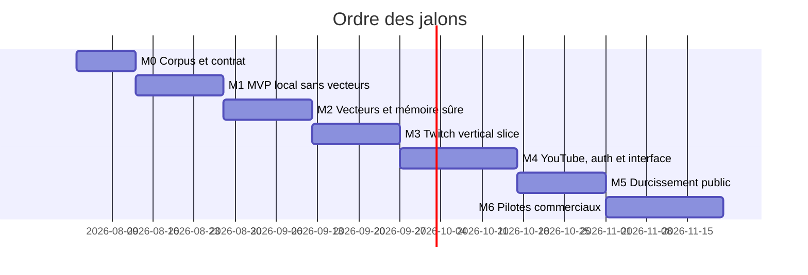

# Roadmap

Chaque jalon traverse configuration, moteur, stockage, interface et test avant
d’ajouter une nouvelle plateforme. Les durées sont indicatives et seront revues après M0.

| Jalon | État au 30 juillet 2026 |
|---|---|
| M0 | en cours — vertical slice et contrat exécutables |
| M1 | démarré — moteur Rust, CLI et Tauri fonctionnels |
| M2–M6 | planifiés, non démarrés |

Les cases cochées correspondent à des artefacts vérifiés dans le dépôt.

## M0 — Corpus, contrat, décision technique

- [x] choisir le cas réel « guess the movie/game » ;
- [x] créer 84 cibles (20 films, 64 jeux) et 28 cas déterministes ;
- [x] figer `Submission` et `Validation` en JSON Schema ;
- [x] tracer bullet message → moteur Rust → JSONL ;
- [x] valider Rust + Tauri comme runtime principal ;
- [x] définir un paquet de contexte diffusable et son profil JSON Schema ;
- [x] vérifier chemins, tailles, SHA-256, SemVer et licence à l’import ;
- [ ] étendre à 200–500 messages annotés, notamment ambiguïtés et hors sujet ;
- [ ] décider la licence publique après comparaison gouvernance/monétisation.

**Sortie actuelle** : corpus versionné, vingt tests Rust, contrats JSON, CLI,
paquet de 84 titres importable et ADR de déploiement évolutif.

## M1 — MVP local sans vecteurs

- [x] contexte JSON, normalisation Unicode, alias et acronymes ;
- [x] score hybride Damerau-Levenshtein/Jaro-Winkler et protection des suites ;
- [x] seuil d’acceptation, zone d’abstention et preuve ;
- [x] CLI sidecar JSONL et exemple de manche ;
- [x] console Tauri sans API loopback ;
- [x] limites défensives côté cœur pour messages, cibles, alias et politiques ;
- [x] sélecteur natif et aperçu inactif d’un paquet dans le client ;
- [x] activation idempotente, versions immuables, rollback et SQLite ;
- [ ] sélection d’une cible active, déduplication et cache borné ;
- [ ] export, commandes d’évaluation et paquets multi-OS ;
- [ ] index public, signatures et règles de révocation des paquets de contexte.

**Sortie** : produit local mesuré, explicable, testé, sans service distant.

## M2 — Vecteurs et mémoire sûre

- embeddings locaux optionnels et index par version ;
- benchmark qualité/latence/taille et calibration ;
- correction opérateur, provenance, validation, rollback ;
- TTL/LRU, quotas, export/import minimisé.

**Sortie** : comparaison M1/M2 ; activation par défaut seulement si la couverture
augmente sans sacrifier la précision cible.

## M3 — Twitch de bout en bout

OAuth minimal, EventSub WebSocket local, reconnexion, déduplication, backpressure,
ajout/suppression d’une source, sandbox d’explication, arrêt et pilote privé.

**Sortie** : un utilisateur non auteur installe, connecte, teste et supprime ses données.

## M4 — YouTube, auth et interface

`liveChatMessages.streamList`, conformité stockage/rafraîchissement, interface web,
auth locale puis OIDC, rôles, audit, coffre de secrets, sauvegarde et révocation.

**Sortie** : mêmes contrats terminal/Twitch/YouTube, consentement vérifié.

## M5 — Ouverture publique

Licence, contribution, code de conduite, sécurité, threat model, SBOM, CI multi-OS,
benchmarks, documentation versionnée, migrations et release `v0.1`.

**Sortie** : une personne externe peut installer, tester, contribuer et signaler une faille.

## M6 — Pilotes et offre

3–5 pilotes, mesure activation/rétention/coût, choix self-hosted/cloud/dual licence,
frontière gratuite/commerciale et décision go/no-go pour `v0.2`.

## Risques à tester tôt

| Risque | Test |
|---|---|
| corpus biaisé | messages hors sujet et revue manuelle dès M0 |
| vecteurs inutiles sur réponses courtes | benchmark contre M1 |
| initiales ambiguës | marge et abstention |
| local trop lourd | machine propre et premier démarrage |
| mémoire non conforme | inventaire champ/durée par source |
| scope trop large | un persona et un cas jusqu’à M3 |

## Prochaine session

Rendre les cibles du paquet actif recherchables et sélectionnables pour configurer
une manche, puis terminer déduplication, cache LRU/TTL versionné et benchmark
p50/p95/p99. Étendre ensuite le corpus avant d’ajouter les embeddings. Préparer en
parallèle l’adaptateur MyVault au contrat JSONL, sans implémenter le scoreboard.
