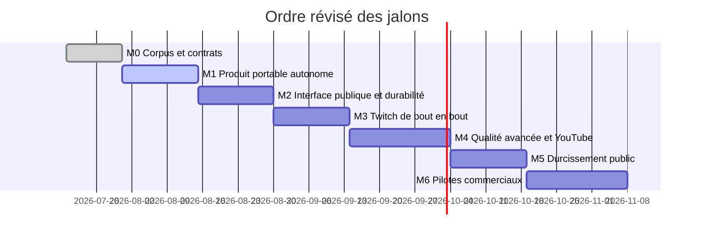

# Roadmap

Chaque jalon traverse configuration, moteur, stockage, interface et tests avant
d'ajouter un nouveau transport ou une nouvelle plateforme. L'autonomie du produit
est un critère de sortie à chaque étape : une intégration externe ne doit jamais
devenir nécessaire au fonctionnement de l'application portable.

| Jalon | État au 1er août 2026 |
|---|---|
| M0 | terminé — corpus initial, contrats et décisions techniques |
| M1 | en cours — produit portable autonome et atelier opérateur |
| M2 | en cours — cycle public v1 livré, durabilité et réseau à faire |
| M3–M6 | planifiés, non démarrés |

## M0 — Corpus, contrats et décisions techniques

- [x] choisir le cas réel « guess the movie/game » ;
- [x] créer 84 cibles et 28 cas déterministes ;
- [x] figer `Submission`, `Validation` et `OperatorResolution` en JSON Schema ;
- [x] tracer le chemin message → moteur Rust → JSONL ;
- [x] valider Rust + Tauri comme runtime principal ;
- [x] définir un paquet de contexte diffusable et son profil JSON Schema ;
- [x] vérifier chemins, tailles, SHA-256, SemVer et licence à l'import ;
- [x] établir que MyVault, Media Catalog et Answer Atlas sont facultatifs ;
- [ ] étendre à 200–500 messages annotés, notamment ambiguïtés et hors sujet ;
- [ ] décider la licence publique après comparaison gouvernance/monétisation.

**Sortie** : corpus versionné, suite Rust reproductible, contrats JSON, CLI et
paquet de titres importable.

## M1 — Produit portable autonome

- [x] normalisation Unicode, alias, acronymes et scores hybrides ;
- [x] seuil d'acceptation, zone d'abstention et preuve ;
- [x] CLI sidecar JSONL ;
- [x] console Tauri appelant Rust en mémoire, sans serveur local ;
- [x] limites défensives pour messages, cibles, alias et politiques ;
- [x] inspection, activation, rollback et persistance SQLite des contextes ;
- [x] recherche bornée et brouillons locaux persistants ;
- [x] résolution opérateur accepter/rejeter sans effacer la décision moteur ;
- [x] portable Windows hors ligne avec WebView2 fixe et checksums ;
- [x] exporter les brouillons comme nouvelle version immuable de paquet ;
- [x] persister l'audit des validations et résolutions ;
- [x] ajouter déduplication et cache borné ;
- [ ] fournir les commandes d'évaluation et les paquets multi-OS ;
- [ ] publier index, signatures et règles de révocation des contextes.

**Critère de sortie** : une personne peut créer ou importer un contexte, lancer
une session, tester et arbitrer sans compte, Internet, MyVault ou catalogue externe.

## M2 — Interface publique et durabilité

Ce jalon rend le produit pilotable sans donner de statut privilégié à un client.

- [x] extraire un module d'application pour validation, déduplication, cache et audit ;
- [x] ajouter le cycle de sessions et le contexte actif au module d’application ;
- [x] figer par tests les contrats de cycle de session et d'événements ;
- [x] conserver JSONL comme transport public sans réseau ;
- [x] persister les sessions et leur journal pour la reprise après redémarrage ;
- ajouter l'adaptateur HTTP/WebSocket local opt-in ;
- lier par défaut à `127.0.0.1`, générer un jeton et contrôler les origines ;
- ajouter quotas, backpressure, idempotence et négociation de version ;
- [x] documenter un kit de conformité et faire passer un client Node indépendant ;
- prévoir un hôte headless sans le rendre nécessaire à Tauri.

**Critère de sortie** : deux clients de test indépendants passent la même suite
contractuelle, tandis que l'application portable fonctionne API réseau désactivée.

## M3 — Twitch de bout en bout

- OAuth minimal et coffre local de secrets ;
- EventSub WebSocket, reconnexion et reprise ;
- traduction vers `Submission` sans modifier le cœur ;
- déduplication, ordre source et backpressure ;
- ajout, test, pause et suppression d'une source dans l'application ;
- mesures p50/p95/p99 sur un flux réaliste ;
- pilote privé et suppression vérifiée des données.

**Critère de sortie** : un utilisateur non auteur connecte Twitch depuis
l'application autonome et peut exploiter les validations via l'interface publique.

## M4 — Qualité avancée et YouTube

- étendre le corpus avant tout ajout vectoriel ;
- comparer embeddings locaux optionnels et moteur lexical ;
- indexer par version de contexte et calibrer sur précision/latence/taille ;
- alimenter une mémoire uniquement depuis des corrections validées ;
- appliquer provenance, consentement, rollback, TTL/LRU et quotas ;
- ajouter YouTube Live Chat avec les mêmes contrats de source ;
- valider le comportement avec et sans fonctionnalités avancées.

**Critère de sortie** : les vecteurs ne sont activés par défaut que si le benchmark
montre un gain utile sans sacrifier précision, explicabilité ou portabilité.

## M5 — Ouverture publique

Licence, contribution, code de conduite, threat model, SBOM, CI multi-OS,
benchmarks reproductibles, documentation versionnée, migrations et release
`v0.1`.

Le code et les petits fixtures peuvent être publics. Les caches de fournisseurs
et données non redistribuables restent hors du dépôt. Answer Atlas peut fournir
des paquets publics et Media Catalog peut aider à les préparer, sans dépendance
d'exécution.

**Critère de sortie** : une personne externe peut installer, utiliser seule,
intégrer, contribuer et signaler une faille.

## M6 — Pilotes et offre

3–5 pilotes couvrant application autonome et intégration, mesure
activation/rétention/coût, choix self-hosted/cloud/dual licence, frontière
gratuite/commerciale et décision go/no-go pour `v0.2`.

## Risques à tester tôt

| Risque | Test |
|---|---|
| couplage à un consommateur | suite de conformité avec deux clients génériques |
| API locale exposée involontairement | désactivation par défaut et test du bind loopback |
| corpus biaisé | messages hors sujet et revue manuelle |
| vecteurs inutiles sur réponses courtes | benchmark contre le moteur lexical |
| initiales ambiguës | marge et abstention |
| local trop lourd | machine propre et premier démarrage |
| mémoire non conforme | inventaire champ/durée par source |
| scope trop large | un persona et un cas jusqu'à M3 |

## Prochaine session

1. Prototyper la passerelle loopback désactivée par défaut.
2. Faire passer la passerelle dans le même kit de conformité.
3. Ajouter quotas, authentification locale et backpressure avant toute source live.

Les intégrations MyVault ou Media Catalog avancent dans leurs propres dépôts et
consomment uniquement des contrats publics ; elles ne bloquent aucun de ces jalons.
